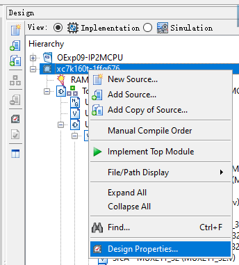

<center>
    <font face="Impact" size="4"><h1>Computer Architecture</h1></font>
    <h1>Lab 1 Report</h1>
</center>
<table align="center">
    <tr>
        <th align="center">Name:</th>
        <td>Asudy Wang 王浚哲</td>
        <th align="center">ID:</th>
        <td>3180103011</td>
        <th align="center">Major:</th>
        <td>Computer Science & Technology</td>
    </tr>
    <tr>
        <th align="center">Course:</th>
        <td colspan="2">Computer Architecture</td>
        <th align="center">Place:</th>
        <td colspan="2">Room 301, Cao Guangbiao Building West Wing, Yuquan Campus</td>
    </tr>
    <tr>
        <td align="center"> <b>Due Date:</b> </td>
        <td> 2020-10-19 </td>
        <td align="center"> <b>Groupmate:</b> </td>
        <td> Qingyi He </td>
        <td align="center"> <b>Instructor:</b> </td>
        <td> Kai Bu </td>
    </tr>
</table>


# Table of Contents

[TOC]

<div style="page-break-after: always;"></div>

# Lab 1. Multicycle CPU Design

## §1 Purposes & Requirements

### 1.1 Experiment Purpose

1. Understand the principles of Multi-cycle CPU Controller and master methods of **Multi-cycle CPU Controller design**.
2. Understand the principles of Datapath and master methods of **Datapath design**.
3. Understand the principles of Multi-cycle CPU and master methods of **Multi-cycle CPU design**.
4. Master methods of **program verification of CPU**.

### 1.2 Experiment Tasks

1. Design the **CPU Controller** and **Datapath**, then **bring together** the basic units into Multi-cycle CPU.
2. **Verify the Multi-cycle CPU with program** and observe the execution of program.
3. The multi-cycle CPU designed in *Computer Organization* can be reused in this lab.


## §2 Contents & Principles

### 2.1 Controller

In an MCPU, the controller is a ***finite state machine*** whose state changes every cycle. In different states, each control signal has different values to make the datapath perform different functions.

The following state diagram shows the states of our MCPU.


### 2.2 Datapath

Since an MCPU execute instructions in multiple cycles, usage of results from the previous cycle is often required. Therefore, compare to an SCPU datapath, some *registers* are added to preserve results from previous cycles.

The following figure shows the schematic of an MCPU datapath.


### 2.3 Basic Units of an MCPU

There are several basic units required to ensure a correct execution of an MCPU.

1. CPU Controller;
2. ALU & ALU Controller;
3. Register File;
4. Data Memory (Storing both instructions & data);
   - Dual Port Block Memory
   - *Port A:* Read Only with width 32 and depth 1024;
   - *Port B:* Read & Write, Read After Write
   - Rising Edge Triggered
5. Registers, Signed/Unsigned-extension Unit, (Shifter), MUXs.


## §3 Main Instruments & Materials

### 3.1 Experiment Instruments

1. A Computer with ISE 14.7 Installed
2. SWORD Board

### 3.2 Experiment Materials

None.


## §4 Experiment Procedure & Operations

For this lab, I used the MCPU design implemented in the course *Computer Organization*, which was designed for running on SWORD boards in the computer lab of Zijingang Campus, Zhejiang University. However it was required that the MCPU implemented in *this* Computer Architecture Lab should be perfectly operating on SWORD boards in Yuquan Campus, which are slightly different from those used in *Computer Organization* labs. 

Therefore, several steps are supposed to be carried out to modify the old MCPU design in order to make our MCPU function again on the new boards (this is also the **main task of this experiment**).

### 4.1 Modify the Project Properties

1. Open the old MCPU ISE project from *Computer Organization* lab course.

2. Double-click or right-click on the *Chip Model* in *Design* panel to open *Design Properties* window.

   

3. In the *Design Properties* window, change "*Device*" and "*Speed*" properties to fit the target device model. For *my* case, "XC7K325T" and "-2L" respectively.

   

4. Click on the "OK" button to save the change.

### 4.2 Add Clock Signal Converter: *clk_200Mto100M*

The new SWORD board uses different on-board clock signals from that of the old boards. To be specific, the new clock signals are "double ended" clock at 200MHz, while the old signal is a "single ended" clock at 100MHz. Therefore, in order to make our MCPU function on the new board, a ***clock signal converter*** needs to be added at the very beginning of the old `clk` wire.

1. Add a new *Verilog Module* source to the project, named as *clk_200Mto100M.v*.

2. Implement the module with Verilog codes as the following. Function/Purpose of each statement is commented in the code block.

   ```verilog
   module clk_200Mto100M(
       input clk200P, clk200N,		// Double ended clock signals from the new board
       input RST,					// Reset signal
       output reg [31:0] clkdiv,	// Clock division output
       output clk100MHz			// 100MHz clock output
       );
       
       IBUFDS sclk(.I(clk200P), .IB(clk200N),
                   // clk: differential clock to single ended clock
                   .O(clk200m));
   
       // Clock divider
       assign clk100MHz = clkdiv[0];	// clkdiv[0] CHANGES it state @200MHz, i.e. the change PERIOD is at 100MHz.
       always @ (posedge clk200m or posedge RST) begin
           if ( RST ) clkdiv <= 0;
           else clkdiv <= clkdiv + 1'b1;	// Overflow -> clkdiv returns to 32'b0
       end
   
   endmodule
   ```

3. (If schematic is used to implement the top module) Run *Create Schematic Symbol* on the clock signal converter module to generate a symbol.

4. Invoke this module in the *top module* and change the name of input clock signals.

   - If you're using schematic approach:

     

   - If you're using Verilog coding approach:

     ```verilog
     clk_200Mto100M clk_cnvt(CLK_200M_P, CLK_200M_N, 1'b0, clk_100mhz);
     ```

### 4.3 Modify Top Module Interface & UCF

Because of the different models between the old and new SWORD boards, a few modifications need to be applied to the *UCF* (User Constraint File).

1. Modify the **clock signal** input pins:

   ```verilog
   NET "CLK_200M_P"		LOC = AC18		| IOSTANDARD = LVDS ;
   NET "CLK_200M_N"		LOC = AD18		| IOSTANDARD = LVDS ;	
   NET "CLK_200M_P" 		TNM_NET = TM_CLK ;
   TIMESPEC TS_CLKIN 	 	= PERIOD "TM_CLK"        5 ns HIGH 50%;
   ```

2. The full UCF used for this lab is shown as follows:

   ```verilog
   # 	## Main clock
       NET "CLK_200M_P"		LOC = AC18		| IOSTANDARD = LVDS ;
       NET "CLK_200M_N"		LOC = AD18		| IOSTANDARD = LVDS ;
   # Timing constraints
       NET "CLK_200M_P" 		TNM_NET = TM_CLK ;
       TIMESPEC TS_CLKIN 	 	= PERIOD "TM_CLK"        5 ns HIGH 50%;
   
   #	## FPGA RST
   	NET "RSTN"				LOC = W13		| IOSTANDARD = LVCMOS18 ;
   
   #	## 7SEG
   	NET "seg_clk"			LOC = M24		| IOSTANDARD = LVCMOS33 ;
   	NET "seg_sout"			LOC = L24       | IOSTANDARD = LVCMOS33 ;
   	NET "SEG_PEN"			LOC = R18       | IOSTANDARD = LVCMOS33 ;
   
   #	## Key Array
   	NET "BTN_x[0]" 			LOC = V17       | IOSTANDARD = LVCMOS18 ;
   	NET "BTN_x[1]" 			LOC = W18       | IOSTANDARD = LVCMOS18 ;
   	NET "BTN_x[2]" 			LOC = W19       | IOSTANDARD = LVCMOS18 ;
   	NET "BTN_x[3]" 			LOC = W15       | IOSTANDARD = LVCMOS18 ;
   	NET "BTN_x[4]" 			LOC = W16       | IOSTANDARD = LVCMOS18 ;
   	NET "BTN_y[0]" 			LOC = V18       | IOSTANDARD = LVCMOS18 ;
   	NET "BTN_y[1]" 			LOC = V19       | IOSTANDARD = LVCMOS18 ;
   	NET "BTN_y[2]" 			LOC = V14       | IOSTANDARD = LVCMOS18 ;
   	NET "BTN_y[3]" 			LOC = W14       | IOSTANDARD = LVCMOS18 ;
   
   #   ## Arduino-Sword-002-Basic IO
       NET "LED[0]"  			LOC = W23		| IOSTANDARD = LVCMOS33 ;
       NET "LED[1]"  			LOC = AB26	    | IOSTANDARD = LVCMOS33 ;
       NET "LED[2]"  			LOC = Y25		| IOSTANDARD = LVCMOS33 ;
       NET "LED[3]"  			LOC = AA23	    | IOSTANDARD = LVCMOS33 ;
       NET "LED[4]"  			LOC = Y23		| IOSTANDARD = LVCMOS33 ;
       NET "LED[5]"  			LOC = Y22		| IOSTANDARD = LVCMOS33 ;
       NET "LED[6]"        	LOC = AE21	    | IOSTANDARD = LVCMOS33 ;
       NET "LED[7]"        	LOC = AF24	    | IOSTANDARD = LVCMOS33 ;
       NET "SEGMENT[7]"	    LOC = AA22	    | IOSTANDARD = LVCMOS33 ;
       NET "SEGMENT[6]"	    LOC = AC23	    | IOSTANDARD = LVCMOS33 ;
       NET "SEGMENT[5]"	    LOC = AC24	    | IOSTANDARD = LVCMOS33 ;
       NET "SEGMENT[4]"	    LOC = W20		| IOSTANDARD = LVCMOS33 ;
       NET "SEGMENT[3]"	    LOC = Y21		| IOSTANDARD = LVCMOS33 ;
       NET "SEGMENT[2]"	    LOC = AD23	    | IOSTANDARD = LVCMOS33 ;
       NET "SEGMENT[1]"	    LOC = AD24	    | IOSTANDARD = LVCMOS33 ;
       NET "SEGMENT[0]"	    LOC = AB22	    | IOSTANDARD = LVCMOS33 ;
       NET "AN[3]"	       		LOC = AC22	    | IOSTANDARD = LVCMOS33 ;
       NET "AN[2]"	       		LOC = AB21	    | IOSTANDARD = LVCMOS33 ;
       NET "AN[1]"       		LOC = AC21	    | IOSTANDARD = LVCMOS33 ;
       NET "AN[0]"       		LOC = AD21	    | IOSTANDARD = LVCMOS33 ;
   
   #	## 16 Leds
       NET "led_clk"			LOC = N26     	| IOSTANDARD = LVCMOS33 ;
       NET "LED_PEN"			LOC = N24       | IOSTANDARD = LVCMOS33 ;     
       NET "led_sout"			LOC = M26       | IOSTANDARD = LVCMOS33 ;
   
   #	## 16 SWs
       NET "SW[15]"			LOC = AF10      | IOSTANDARD = LVCMOS15 ;
       NET "SW[14]"			LOC = AF13      | IOSTANDARD = LVCMOS15 ;
       NET "SW[13]"			LOC = AE13      | IOSTANDARD = LVCMOS15 ;
       NET "SW[12]"			LOC = AF8	    | IOSTANDARD = LVCMOS15 ;
       NET "SW[11]"			LOC = AE8	    | IOSTANDARD = LVCMOS15 ;
       NET "SW[10]"			LOC = AF12      | IOSTANDARD = LVCMOS15 ;
       NET "SW[9]"				LOC = AE12      | IOSTANDARD = LVCMOS15 ;
       NET "SW[8]"				LOC = AE10      | IOSTANDARD = LVCMOS15 ;
       NET "SW[7]"				LOC = AD10      | IOSTANDARD = LVCMOS15 ;
       NET "SW[6]"				LOC = AD11      | IOSTANDARD = LVCMOS15 ;
       NET "SW[5]"				LOC = Y12	    | IOSTANDARD = LVCMOS15 ;
       NET "SW[4]"				LOC = Y13	    | IOSTANDARD = LVCMOS15 ;
       NET "SW[3]"				LOC = AA12      | IOSTANDARD = LVCMOS15 ;
       NET "SW[2]"				LOC = AA13      | IOSTANDARD = LVCMOS15 ;
       NET "SW[1]"				LOC = AB10      | IOSTANDARD = LVCMOS15 ;
       NET "SW[0]"				LOC = AA10     	| IOSTANDARD = LVCMOS15 ;
   
   #	## TriLEDs
       NET "CR"				LOC = V22		| IOSTANDARD = LVCMOS33 ; # B
       NET "readn"				LOC = U22       | IOSTANDARD = LVCMOS33 ; # G
       NET "RDY"				LOC = U21       | IOSTANDARD = LVCMOS33 ; # R
   ```

3. [*Appendix*] Correspondence of *LED* & *GPIO* pins between the old and new UCFs:

   | Old UCF |    New UCF    | New LOC |
   | :-----: | :-----------: | :-----: |
   | LEDCLK  |    led_clk    |   N26   |
   |  LEDEN  |    led_pen    |   N24   |
   |  LEDDT  |    led_do     |   M26   |
   | LEDCLR  | *\*Removed\** |    –    |
   | SEGCLK  |    seg_clk    |   M24   |
   |  SEGEN  |    seg_pen    |   R18   |
   |  SEGDT  |    seg_do     |   L24   |
   | SEGCLR  | *\*Removed\** |    –    |

### 4.4 Verify the MCPU Design

1. Write a verification program using MIPS assembly. In this lab, I wrote a simple program to help verify the function of our MCPU.

   

2. Convert the assembly language to hexadecimal instruction words using an *assembler* (also implemented in *Computer Organization*).

3. Construct a *.coe file* according to the hexadecimal instruction words.

4. Reinitialize the RAM in the *top module* with the new *coe file*.

   1. Double-click or right-click on the RAM to *open* it.

      

   2. Click "*Next*" until you get to *Page 4*, then click "*Browse*" to select the new coe file (and click "*Show*" to check its content after loading). If you think all things are set, click "*Generate*" at the bottom right corner to confirm your change.

      **Note:** Due to the feature of ISE, the *new coe file* needs to be at the **same path** as the *old coe file*, or the memory regeneration will NOT successfully change its content.

      

5. *Generate Programming File* of the top module and upload the *.bit file* to the new SWOAR board to see whether the MCPU design works.


## §5 Results & Analysis

### 5.1 Top Module Overview

After modification, the top module schematic of the MCPU design is shown in the screenshot below.


### 5.2 Function Verification

1. The assembly program shown above is assembled into machine code. The **conversion** from the MIPS assembly to the *coe file* is shown below:

   

2. After loading the new coe file to the RAM, the RAM was **successfully regenerated**. And the *Programming File* of the top module was **successfully generated and uploaded** to the new SWORD board.

3. The program was executed as desired on the SWORD board. The following links are 2 video clips showcasing current PC Value & Instruction Word changing on our MCPU.

   > 1. PC Value Demo Video
   >
   >    https://ckcyouth.zju.edu.cn:8080/s/xNF34Lp7iQQjXJc
   >
   > 2. Instruction Word Demo Video
   >
   >    https://ckcyouth.zju.edu.cn:8080/s/mkHrJ6wAmD9pcbc

   We can see from the videos that, the MCPU is running the same machine codes as the coe file specified, and the PC value increases by $4$ every clock cycle until a *jump instruction* brings it back to line 3: `add $v1 $zero $zero`. **We can conclude that our MCPU was working as expected.**


## §6 Discussion & Experience

This lab was a "warmup" lab, whose main task was to adapt our old MCPU design implemented in *Computer Organization* to the new SWORD boards, giving me a chance to carefully review my implementation of the MCPU.

In the process, I re-read all codes of the design, reviewing the internal logic relations between different modules, and accidentally found that the implementation of the *shift instructions* `srl` and `sll` were incorrect. My ALU was not able to shift the input according to the *shamt* field of the instruction. What's more, I found the codes about *Jump Address Construction* of the *J-Type* instruction was wrong.

Besides, the completion of this lab was based on the familiarization of the new experiment environment. I got familiar with the new *user constraints* and some new features (like clock difference) about the new boards throughout these days. I'd say I've learnt a lot.

