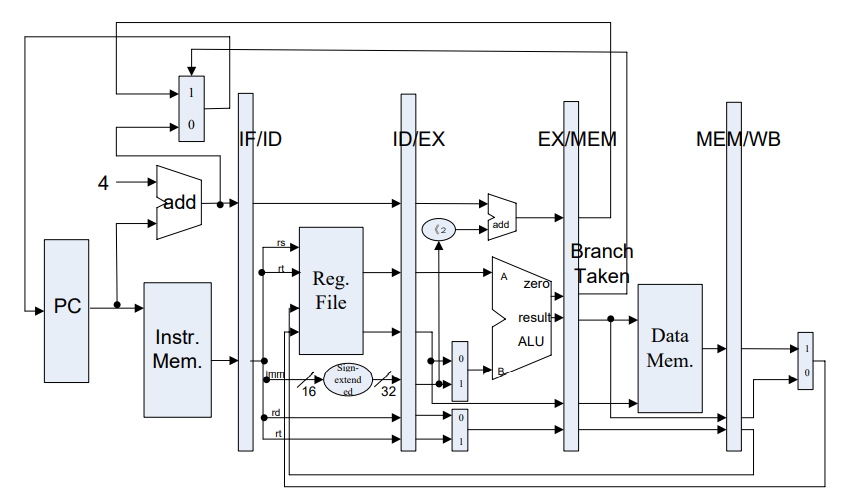
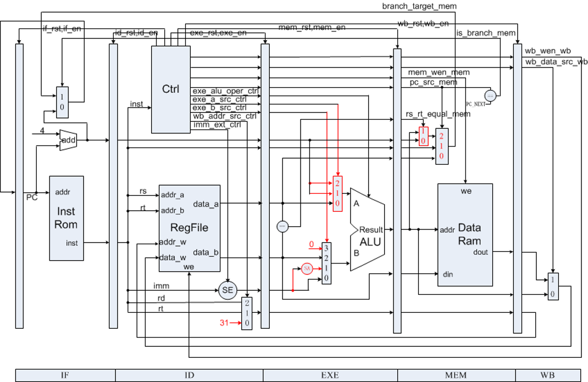
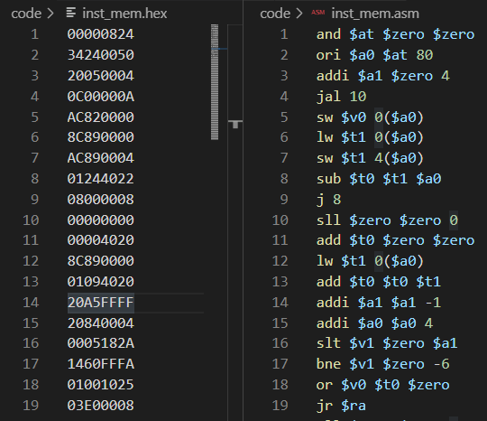

<center>
    <font face="Impact" size="4"><h1>Computer Architecture</h1></font>
    <h1>Lab 2 Report</h1>
</center>
<table align="center">
    <tr>
        <th align="center">Name:</th>
        <td>Asudy Wang 王浚哲</td>
        <th align="center">ID:</th>
        <td>3180103011</td>
        <th align="center">Major:</th>
        <td>Computer Science & Technology</td>
    </tr>
    <tr>
        <th align="center">Course:</th>
        <td colspan="2">Computer Architecture</td>
        <th align="center">Place:</th>
        <td colspan="2">Room 301, Cao Guangbiao Building West Wing, Yuquan Campus</td>
    </tr>
    <tr>
        <td align="center"> <b>Due Date:</b> </td>
        <td> 2020-12-07 </td>
        <td align="center"> <b>Groupmate:</b> </td>
        <td> Flaze He </td>
        <td align="center"> <b>Instructor:</b> </td>
        <td> Kai Bu </td>
    </tr>
</table>


# Table of Contents

[TOC]

# Lab 2. 5-Stage Pipelined CPU

## §1 Purposes & Requirements

### 1.1 Experiment Purpose

- Understand the **principles** of *Pipelined CPU*;
- Understand the **basic units** of *Pipelined CPU*;
- Understand the **working flow** of a *5-stage pipeline*;
- Master the method of implementing a simple *Pipelined CPU*;
- Master methods of program verification of simple *Pipelined CPU*.

### 1.2 Experiment Tasks

- Design the CPU **controller** & **datapath** of the *5-stage Pipelined CPU*.
  - 5-stage implementation
  - Register File
  - Memory (instruction & data memories)
  - Other basic & auxiliary units
- Verify the *Pipelined CPU* with program and observe the execution of the program.


## §2 Contents & Principles

### 2.1 Datapath

The **5-staged** pipelined datapath divides the workflow of a CPU into 5 specific stages: *IF* (Instruction Fetch), *ID* (Instruction Decode & register fetch), *EXE* (EXEcution), *MEM* (MEMory access) and *WB* (Write Back). The key idea of the *Pipelined CPU* is, whenever an instruction is using units in a certain stage, other instructons are able to use other stages **simultaneously**. Thus in a 5-staged pipeline, 5 instructions can be executed parallelly.

A simplified vesion of the pipelined datapath we're implementing in this lab is as the following.




### 2.2 Controller

The controller in the pipelined CPU translates the input **instruction** into several **control signals** asynchronously. Different control signals select inputs for datapath units, control write enable for registers and memories, and decide whether a certain stage in the datapath is enabled/cleared. A **datapath with controller** in the pipelined CPU is shown as the following figure:




### 2.3 Basic Units of a Pipelined CPU

1. CPU Controller
2. **Stage Registers**
3. Register File
   - Positive edge: transfer data for stages
   - Negative edge: write
4. Memories
   - Instruction Memory
     - Read-only, with width 32
     - Falling-edge triggered
   - Data Memory
     - Read and Write, with width 32
     - Falling-edge triggered
5. ALU
6. Other registers, Signed/Unsigned-extension unit, MUXs


## §3 Main Instruments & Materials

### 3.1 Experiment Instruments

1. A Computer with ISE 14.7 Installed
2. SWORD Board

### 3.2 Experiment Materials

None.


## §4 Experiment Procedure & Operations

Thanks to the SWORD Website who provided us with very helpful Verilog implementations of all units we need except for the *controller* and the *datapath* (can be downloaded [here](http://www.sword.org.cn/courses/CompArch)), all we need to do in this lab is to fill in the blanks in the *controller & datapath* modules, and test if our code makes the CPU run expectedly.

### 4.1 Finish `controller.v`

1. Open file `controller.v` (in the files downloaded just now) in a text editor. We can find that some codes are masked by `???`.

2. Fill in the blanks in the **instruction decode part** according to the functions of each given instruction. All *parameter* definitions can be found in file `mips_define.vh`. Always use symbols provided in that file if possible.

   - For example, the decoding of `ADD` instruction is:

     ```verilog
     case ...
         R_FUNC_ADD: begin
             exe_alu_oper = EXE_ALU_ADD;	// ALU operation type: +
             wb_addr_src = WB_ADDR_RD;	// Write back addr.: rd
             wb_data_src = WB_DATA_ALU;	// Write back data: ALUout
             wb_wen = 1;		// Write back REG enable: true
             rs_used = 1;	// rs register used: true
             rt_used = 1;	// rt register used: true
         end
     ...
     ```

   - To reduce the length of the report, the full code is provided in *Appendix A*.

3. Other `???`s lie in the **pipeline control part** which is implemented for possible *stalls*. Since *stall implementation is not required* in this lab (Lab 2), the detail will be discussed in the next lab report. However you may find the finished code in *Appendix A* as well.

### 4.2 Finish `datapath.v`

1. Open file `datapath.v` (in the files downloaded just now) in a text editor. We can find that some codes are masked by `???`.

2. Fill in the blanks about **write back addr selection**, **write back data selection**, **ALU input selection** and **target PC selection** according to meanings of the given control signals. All *parameter* definitions can be found in file `mips_define.vh`. Always use symbols provided in that file if possible.

   1. ***Write Back Addr Selection***

      ```verilog
      always @(*) begin
      	regw_addr_id = inst_data_id[15:11];
      	case (wb_addr_src_ctrl)
      		WB_ADDR_RD: regw_addr_id = addr_rd;
      		WB_ADDR_RT: regw_addr_id = addr_rt;
      		WB_ADDR_LINK: regw_addr_id = GPR_RA;
      	endcase
      end
      ```

   2. ***Write Back Data Selection***

      ```verilog
      always @(*) begin
      	regw_data_wb = alu_out_wb;
      	case (wb_data_src_wb)
      		WB_DATA_ALU: regw_data_wb = alu_out_wb;
      		WB_DATA_MEM: regw_data_wb = mem_din_wb;
      	endcase
      end
      ```

   3. ***ALU Input Selection***

      ```verilog
      always @(*) begin
      	opa_exe = data_rs_exe;
      	opb_exe = data_rt_exe;
          case (exe_a_src_exe)	// ALU input A source selection
      		EXE_A_RS: opa_exe = data_rs_exe;
      		EXE_A_LINK: opa_exe = inst_addr_next_exe;
      		EXE_A_BRANCH: opa_exe = inst_addr_next_exe;
      	endcase
          case (exe_b_src_exe)	// ALU input B source selection
      		EXE_B_RT: opb_exe = data_rt_exe;
      		EXE_B_IMM: opb_exe = data_imm_exe;
      		EXE_B_LINK: opb_exe = 32'h0;  
      		EXE_B_BRANCH: opb_exe = {data_imm_exe[29:0], 2'b0};
      	endcase
      end
      ```

   4. ***Target PC Selection***

      ```verilog
      always @(*) begin
      	case (pc_src_mem)
              PC_JUMP: branch_target_mem <= {
                  inst_addr_mem[31:28], inst_data_mem[25:0], 2'b0
              };
      		PC_JR: branch_target_mem <= data_rs_mem;
      		PC_BEQ: branch_target_mem <= rs_rt_equal_mem ?
      				alu_out_mem : inst_addr_next_mem ;
      		PC_BNE: branch_target_mem <= rs_rt_equal_mem ?
      				inst_addr_next_mem : alu_out_mem ;
      		default: branch_target_mem <= inst_addr_next_mem;  // never used
      	endcase
      end
      ```

3. The full code of *datapath* is provided in *Appendix B* of this report.

### 4.3 Verify the Pipelined CPU Design

1. Use the program provided by the template (`inst_mem.hex`) to verify the implementation of our *Pipelined CPU*. The code is provided in hexadecimal, which is very difficult for humans to understand. Converting it to something human-readable using a disassembler is a great idea. The translated program (in MIPS) is as the following:

   

2. Open the *ISE Project* and *Generate Programming File* of the top module, then upload the *.bit file* to the SWORD borad to see whether our pipelined CPU works as desired.


## §5 Results & Analysis

### 5.1 Function Verification

1. The hexadecimal file used to verify the design and its MIPS assembly comparison is show in the following figure:

   

2. The *Programming File* of the top module was **successfully generated and uploaded** to the SWORD board.

3. Turning on `SW[0]` on borad makes the CPU enter *single-step debug* mode, during which time the *bottom-left* `BTN` makes it step forward. All debug information is shown on the *VGA display* connected to the board. 

   You can refer to the *appended zip file* for the photos of the full execution progress of the above program.

4. Accoding to our observation, the program was exected **as desired** on the SWORD borad. **We concluded that our *Pipelined CPU* was working as expected.**


## §6 Discussion & Experience

In this experiment, I got to know the detailed implementation of a pipelined CPU rather than the theorems.

Before I started this lab, I had no idea how to implement such a pipelined CPU in practice. The template provided by SWORD really helped me to construct an outline of the design.

When we tried to fill in the blanks in those files, we suffered from figuring out what all the control signals actually controls since there isn't a visualized schematic provided. With the help of the comments and our teammates, we managed to figure that out and our understanding about the pipeline was further deepend.

<div style="page-break-after: always;"></div>

## Appendix A. *controller.v*

```verilog
`include "define.vh"

/**
 * Controller for MIPS 5-stage pipelined CPU.
 * Author: Zhao, Hongyu  <power_zhy@foxmail.com>
 */
module controller (/*AUTOARG*/
	input wire clk,  // main clock
	input wire rst,  // synchronous reset
	// debug
	`ifdef DEBUG
	input wire debug_en,  // debug enable
	input wire debug_step,  // debug step clock
	`endif
	// instruction decode
	input wire [31:0] inst,  // instruction
	input wire is_branch_exe,  // whether instruction in EXE stage is jump/branch instruction
	input wire [4:0] regw_addr_exe,  // register write address from EXE stage
	input wire wb_wen_exe,  // register write enable signal feedback from EXE stage
	input wire is_branch_mem,  // whether instruction in MEM stage is jump/branch instruction
	input wire [4:0] regw_addr_mem,  // register write address from MEM stage
	input wire wb_wen_mem,  // register write enable signal feedback from MEM stage
	output reg [2:0] pc_src,  // how would PC change to next
	output reg imm_ext,  // whether using sign extended to immediate data
	output reg [1:0] exe_a_src,  // data source of operand A for ALU
	output reg [1:0] exe_b_src,  // data source of operand B for ALU
	output reg [3:0] exe_alu_oper,  // ALU operation type
	output reg mem_ren,  // memory read enable signal
	output reg mem_wen,  // memory write enable signal
	output reg [1:0] wb_addr_src,  // address source to write data back to registers
	output reg wb_data_src,  // data source of data being written back to registers
	output reg wb_wen,  // register write enable signal
	output reg unrecognized,  // whether current instruction can not be recognized
	// pipeline control
	output reg if_rst,  // stage reset signal
	output reg if_en,  // stage enable signal
	input wire if_valid,  // stage valid flag
	output reg id_rst,
	output reg id_en,
	input wire id_valid,
	output reg exe_rst,
	output reg exe_en,
	input wire exe_valid,
	output reg mem_rst,
	output reg mem_en,
	input wire mem_valid,
	output reg wb_rst,
	output reg wb_en,
	input wire wb_valid
	);
	
	`include "mips_define.vh"
	
	// instruction decode
	reg rs_used, rt_used;
	
	always @(*) begin		/* Decode inst */
		pc_src = PC_NEXT;
		imm_ext = 0;
		exe_a_src = EXE_A_RS;
		exe_b_src = EXE_B_RT;
		exe_alu_oper = EXE_ALU_ADD;
		mem_ren = 0;
		mem_wen = 0;
		wb_addr_src = WB_ADDR_RD;
		wb_data_src = WB_DATA_ALU;
		wb_wen = 0;
		rs_used = 0;
		rt_used = 0;
		unrecognized = 0;
		case (inst[31:26])
			INST_R: begin
				case (inst[5:0])
					R_FUNC_JR: begin
						pc_src = PC_JR;
						rs_used = 1;
					end
					R_FUNC_ADD: begin
						exe_alu_oper = EXE_ALU_ADD;
						wb_addr_src = WB_ADDR_RD;
						wb_data_src = WB_DATA_ALU;
						wb_wen = 1;
						rs_used = 1;
						rt_used = 1;
					end
					R_FUNC_SUB: begin
						exe_alu_oper = EXE_ALU_SUB;
						wb_addr_src = WB_ADDR_RD;
						wb_data_src = WB_DATA_ALU;
						wb_wen = 1;
						rs_used = 1;
						rt_used = 1;
					end
					R_FUNC_AND: begin
						exe_alu_oper = EXE_ALU_AND;
						wb_addr_src = WB_ADDR_RD;
						wb_data_src = WB_DATA_ALU;
						wb_wen = 1;
						rs_used = 1;
						rt_used = 1;
					end
					R_FUNC_OR: begin
						exe_alu_oper = EXE_ALU_OR;
						wb_addr_src = WB_ADDR_RD;
						wb_data_src = WB_DATA_ALU;
						wb_wen = 1;
						rs_used = 1;
						rt_used = 1;
					end
					R_FUNC_SLT: begin
						exe_alu_oper = EXE_ALU_SLT;
						wb_addr_src = WB_ADDR_RD;
						wb_data_src = WB_DATA_ALU;
						wb_wen = 1;
						rs_used = 1;
						rt_used = 1;
					end
					default: begin
						unrecognized = 1;
					end
				endcase
			end
			INST_J: begin
				pc_src = PC_JUMP;
			end
			INST_JAL: begin
				pc_src = PC_JUMP;
				exe_a_src = EXE_A_LINK;
				exe_b_src = EXE_B_LINK;
				exe_alu_oper = EXE_ALU_ADD;
				wb_addr_src = WB_ADDR_LINK;
				wb_data_src = WB_DATA_ALU;
				wb_wen = 1;
			end
			INST_BEQ: begin
				pc_src = PC_BEQ;
				exe_a_src = EXE_A_BRANCH;
				exe_b_src = EXE_B_BRANCH;
				exe_alu_oper = EXE_ALU_ADD;
				imm_ext = 1;
				rs_used = 1;
				rt_used = 1;
			end
			INST_BNE: begin
				pc_src = PC_BNE;
				exe_a_src = EXE_A_BRANCH;
				exe_b_src = EXE_B_BRANCH;
				exe_alu_oper = EXE_ALU_ADD;
				imm_ext = 1;
				rs_used = 1;
				rt_used = 1;
			end
			INST_ADDI: begin
				imm_ext = 1;
				exe_b_src = EXE_B_IMM;
				exe_alu_oper = EXE_ALU_ADD;
				wb_addr_src = WB_ADDR_RT;
				wb_data_src = WB_DATA_ALU;
				wb_wen = 1;
				rs_used = 1;
			end
			INST_ANDI: begin
				imm_ext = 0;
				exe_b_src = EXE_B_IMM;
				exe_alu_oper = EXE_ALU_AND;
				wb_addr_src = WB_ADDR_RT;
				wb_data_src = WB_DATA_ALU;
				wb_wen = 1;
				rs_used = 1;
			end
			INST_ORI: begin
				imm_ext = 0;
				exe_b_src = EXE_B_IMM;
				exe_alu_oper = EXE_ALU_OR;
				wb_addr_src = WB_ADDR_RT;
				wb_data_src = WB_DATA_ALU;
				wb_wen = 1;
				rs_used = 1;
			end
			INST_LW: begin
				imm_ext = 1;
				exe_b_src = EXE_B_IMM;
				exe_alu_oper = EXE_ALU_ADD;
				mem_ren = 1;
				wb_addr_src = WB_ADDR_RT;
				wb_data_src = WB_DATA_MEM;
				wb_wen = 1;
				rs_used = 1;
			end
			INST_SW: begin
				imm_ext = 1;
				exe_b_src = EXE_B_IMM;
				exe_alu_oper = EXE_ALU_ADD;
				mem_wen = 1;
				rs_used = 1;
				rt_used = 1;
			end
			default: begin
				unrecognized = 1;
			end
		endcase
	end
	
	/* pipeline control (stall) */
	reg reg_stall;
	reg branch_stall;
	wire [4:0] addr_rs, addr_rt;
	
	assign
		addr_rs = inst[25:21],
		addr_rt = inst[20:16];
	
	always @(*) begin
		reg_stall = 0;
		if (rs_used && addr_rs != 0) begin
			if (regw_addr_exe == addr_rs && wb_wen_exe) begin
				reg_stall = 1;
			end
			else if (regw_addr_mem == addr_rs && wb_wen_mem) begin
				reg_stall = 1;
			end
		end
		if (rt_used && addr_rt != 0) begin
			if (regw_addr_exe == addr_rt && wb_wen_exe) begin
				reg_stall = 1;
			end
			else if (regw_addr_mem == addr_rt && wb_wen_mem) begin
				reg_stall = 1;
			end
		end
	end
	
	always @(*) begin
		branch_stall = 0;
		if (pc_src != PC_NEXT || is_branch_exe || is_branch_mem)
			branch_stall = 1;
	end
	
	`ifdef DEBUG
	reg debug_step_prev;
	
	always @(posedge clk) begin
		debug_step_prev <= debug_step;
	end
	`endif
	
	always @(*) begin
		if_rst = 0;
		if_en = 1;
		id_rst = 0;
		id_en = 1;
		exe_rst = 0;
		exe_en = 1;
		mem_rst = 0;
		mem_en = 1;
		wb_rst = 0;
		wb_en = 1;
		if (rst) begin
			if_rst = 1;
			id_rst = 1;
			exe_rst = 1;
			mem_rst = 1;
			wb_rst = 1;
		end
		`ifdef DEBUG
		// suspend and step execution
		else if ((debug_en) && ~(~debug_step_prev && debug_step)) begin
			if_en = 0;
			id_en = 0;
			exe_en = 0;
			mem_en = 0;
			wb_en = 0;
		end
		`endif
		// this stall indicate that ID is waiting for previous instruction, should insert NOPs between ID and EXE.
		else if (reg_stall) begin
			if_en = 0;
			id_en = 0;
			exe_rst = 1;
		end
		// this stall indicate that a jump/branch instruction is running, so that 3 NOP should be inserted between IF and ID
		else if (branch_stall) begin
			id_rst = 1;
		end
	end
	
endmodule
```

<div style="page-break-after: always;"></div>

## Appendix B. *datapath.v*

```verilog
`include "define.vh"

/**
 * Data Path for MIPS 5-stage pipelined CPU.
 * Author: Zhao, Hongyu  <power_zhy@foxmail.com>
 */
module datapath (
	input wire clk,  // main clock
	// debug
	`ifdef DEBUG
	input wire [5:0] debug_addr,  // debug address
	output wire [31:0] debug_data,  // debug data
	`endif
	// control signals
	output reg [31:0] inst_data_id,  // instruction
	output reg is_branch_exe,  // whether instruction in EXE stage is jump/branch instruction
	output reg [4:0] regw_addr_exe,  // register write address from EXE stage
	output reg wb_wen_exe,  // register write enable signal feedback from EXE stage
	output reg is_branch_mem,  // whether instruction in MEM stage is jump/branch instruction
	output reg [4:0] regw_addr_mem,  // register write address from MEM stage
	output reg wb_wen_mem,  // register write enable signal feedback from MEM stage
	input wire [2:0] pc_src_ctrl,  // how would PC change to next
	input wire imm_ext_ctrl,  // whether using sign extended to immediate data
	input wire [1:0] exe_a_src_ctrl,  // data source of operand A for ALU
	input wire [1:0] exe_b_src_ctrl,  // data source of operand B for ALU
	input wire [3:0] exe_alu_oper_ctrl,  // ALU operation type
	input wire mem_ren_ctrl,  // memory read enable signal
	input wire mem_wen_ctrl,  // memory write enable signal
	input wire [1:0] wb_addr_src_ctrl,  // address source to write data back to registers
	input wire wb_data_src_ctrl,  // data source of data being written back to registers
	input wire wb_wen_ctrl,  // register write enable signal
	// IF signals
	input wire if_rst,  // stage reset signal
	input wire if_en,  // stage enable signal
	output reg if_valid,  // working flag
	output reg inst_ren,  // instruction read enable signal
	output reg [31:0] inst_addr,  // address of instruction needed
	input wire [31:0] inst_data,  // instruction fetched
	// ID signals
	input wire id_rst,
	input wire id_en,
	output reg id_valid,
	// EXE signals
	input wire exe_rst,
	input wire exe_en,
	output reg exe_valid,
	// MEM signals
	input wire mem_rst,
	input wire mem_en,
	output reg mem_valid,
	output wire mem_ren,  // memory read enable signal
	output wire mem_wen,  // memory write enable signal
	output wire [31:0] mem_addr,  // address of memory
	output wire [31:0] mem_dout,  // data writing to memory
	input wire [31:0] mem_din,  // data read from memory
	// WB signals
	input wire wb_rst,
	input wire wb_en,
	output reg wb_valid
	);
	
	`include "mips_define.vh"
	
	// control signals
	reg [2:0] pc_src_exe, pc_src_mem;
	reg [1:0] exe_a_src_exe, exe_b_src_exe;
	reg [3:0] exe_alu_oper_exe;
	reg mem_ren_exe, mem_ren_mem;
	reg mem_wen_exe, mem_wen_mem;
	reg wb_data_src_exe, wb_data_src_mem, wb_data_src_wb;
	
	// IF signals
	wire [31:0] inst_addr_next;
	
	// ID signals
	reg [31:0] inst_addr_id;
	reg [31:0] inst_addr_next_id;
	reg [4:0] regw_addr_id;
	wire [4:0] addr_rs, addr_rt, addr_rd;
	wire [31:0] data_rs, data_rt, data_imm;
	
	// EXE signals
	reg [31:0] inst_addr_exe;
	reg [31:0] inst_addr_next_exe;
	reg [31:0] inst_data_exe;
	reg [31:0] data_rs_exe, data_rt_exe, data_imm_exe;
	reg [31:0] opa_exe, opb_exe;
	wire [31:0] alu_out_exe;
	wire rs_rt_equal_exe;
	
	// MEM signals
	reg [31:0] inst_addr_mem;
	reg [31:0] inst_addr_next_mem;
	reg [31:0] inst_data_mem;
	reg [4:0] data_rs_mem;
	reg [31:0] data_rt_mem;
	reg [31:0] alu_out_mem;
	reg [31:0] branch_target_mem;
	reg rs_rt_equal_mem;
	
	// WB signals
	reg wb_wen_wb;
	reg [31:0] alu_out_wb;
	reg [31:0] mem_din_wb;
	reg [4:0] regw_addr_wb;
	reg [31:0] regw_data_wb;
	
	// debug
	`ifdef DEBUG
	wire [31:0] debug_data_reg;
	reg [31:0] debug_data_signal;
	
	always @(posedge clk) begin
		case (debug_addr[4:0])
			0: debug_data_signal <= inst_addr;
			1: debug_data_signal <= inst_data;
			2: debug_data_signal <= inst_addr_id;
			3: debug_data_signal <= inst_data_id;
			4: debug_data_signal <= inst_addr_exe;
			5: debug_data_signal <= inst_data_exe;
			6: debug_data_signal <= inst_addr_mem;
			7: debug_data_signal <= inst_data_mem;
			8: debug_data_signal <= {27'b0, addr_rs};
			9: debug_data_signal <= data_rs;
			10: debug_data_signal <= {27'b0, addr_rt};
			11: debug_data_signal <= data_rt;
			12: debug_data_signal <= data_imm;
			13: debug_data_signal <= opa_exe;
			14: debug_data_signal <= opb_exe;
			15: debug_data_signal <= alu_out_exe;
			16: debug_data_signal <= 0;
			17: debug_data_signal <= 0;
			18: debug_data_signal <= {19'b0, inst_ren, 7'b0, mem_ren, 3'b0, mem_wen};
			19: debug_data_signal <= mem_addr;
			20: debug_data_signal <= mem_din;
			21: debug_data_signal <= mem_dout;
			22: debug_data_signal <= {27'b0, regw_addr_wb};
			23: debug_data_signal <= regw_data_wb;
			default: debug_data_signal <= 32'hFFFF_FFFF;
		endcase
	end
	
	assign
		debug_data = debug_addr[5] ? debug_data_signal : debug_data_reg;
	`endif
	
	// IF stage
	assign
		inst_addr_next = inst_addr + 4;
	
	always @(*) begin
		if_valid = ~if_rst & if_en;
		inst_ren = ~if_rst;
	end
	
	always @(posedge clk) begin
		if (if_rst) begin
			inst_addr <= 0;
		end
		else if (if_en) begin
			if (is_branch_mem)
				inst_addr <= branch_target_mem;
			else
				inst_addr <= inst_addr_next;
		end
	end
	
	// ID stage
	always @(posedge clk) begin
		if (id_rst) begin
			id_valid <= 0;
			inst_addr_id <= 0;
			inst_data_id <= 0;
			inst_addr_next_id <= 0;
		end
		else if (id_en) begin
			id_valid <= if_valid;
			inst_addr_id <= inst_addr;
			inst_data_id <= inst_data;
			inst_addr_next_id <= inst_addr_next;
		end
	end
	
	assign
		addr_rs = inst_data_id[25:21],
		addr_rt = inst_data_id[20:16],
		addr_rd = inst_data_id[15:11],
		data_imm = imm_ext_ctrl ? {{16{inst_data_id[15]}}, inst_data_id[15:0]} : {16'b0, inst_data_id[15:0]};
	
	always @(*) begin
		regw_addr_id = inst_data_id[15:11];
		case (wb_addr_src_ctrl)
			WB_ADDR_RD: regw_addr_id = addr_rd;
			WB_ADDR_RT: regw_addr_id = addr_rt;
			WB_ADDR_LINK: regw_addr_id = GPR_RA;
		endcase
	end
	
	regfile REGFILE (
		.clk(clk),
		`ifdef DEBUG
		.debug_addr(debug_addr[4:0]),
		.debug_data(debug_data_reg),
		`endif
		.addr_a(addr_rs),
		.data_a(data_rs),
		.addr_b(addr_rt),
		.data_b(data_rt),
		.en_w(wb_wen_wb),
		.addr_w(regw_addr_wb),
		.data_w(regw_data_wb)
		);
	
	// EXE stage
	always @(posedge clk) begin
		if (exe_rst) begin
			exe_valid <= 0;
			inst_addr_exe <= 0;
			inst_data_exe <= 0;
			inst_addr_next_exe <= 0;
			regw_addr_exe <= 0;
			pc_src_exe <= 0;
			exe_a_src_exe <= 0;
			exe_b_src_exe <= 0;
			data_rs_exe <= 0;
			data_rt_exe <= 0;
			data_imm_exe <= 0;
			exe_alu_oper_exe <= 0;
			mem_ren_exe <= 0;
			mem_wen_exe <= 0;
			wb_data_src_exe <= 0;
			wb_wen_exe <= 0;
		end
		else if (exe_en) begin
			exe_valid <= id_valid;
			inst_addr_exe <= inst_addr_id;
			inst_data_exe <= inst_data_id;
			inst_addr_next_exe <= inst_addr_next_id;
			regw_addr_exe <= regw_addr_id;
			pc_src_exe <= pc_src_ctrl;
			exe_a_src_exe <= exe_a_src_ctrl;
			exe_b_src_exe <= exe_b_src_ctrl;
			data_rs_exe <= data_rs;
			data_rt_exe <= data_rt;
			data_imm_exe <= data_imm;
			exe_alu_oper_exe <= exe_alu_oper_ctrl;
			mem_ren_exe <= mem_ren_ctrl;
			mem_wen_exe <= mem_wen_ctrl;
			wb_data_src_exe <= wb_data_src_ctrl;
			wb_wen_exe <= wb_wen_ctrl;
		end
	end
	
	always @(*) begin
		is_branch_exe <= (pc_src_exe != PC_NEXT);
	end
	
	assign
		rs_rt_equal_exe = (data_rs_exe == data_rt_exe);
	
	always @(*) begin
		opa_exe = data_rs_exe;
		opb_exe = data_rt_exe;
		case (exe_a_src_exe)
			EXE_A_RS: opa_exe = data_rs_exe;
			EXE_A_LINK: opa_exe = inst_addr_next_exe;
			EXE_A_BRANCH: opa_exe = inst_addr_next_exe;
		endcase
		case (exe_b_src_exe)
			EXE_B_RT: opb_exe = data_rt_exe;
			EXE_B_IMM: opb_exe = data_imm_exe;
			EXE_B_LINK: opb_exe = 32'h0;  // linked address is the next one of current instruction
			EXE_B_BRANCH: opb_exe = {
				data_imm_exe[29:0], 2'b0
				};
		endcase
	end
	
	alu ALU (
		.a(opa_exe),
		.b(opb_exe),
		.oper(exe_alu_oper_exe),
		.result(alu_out_exe)
		);
	
	// MEM stage
	always @(posedge clk) begin
		if (mem_rst) begin
			mem_valid <= 0;
			pc_src_mem <= 0;
			inst_addr_mem <= 0;
			inst_data_mem <= 0;
			inst_addr_next_mem <= 0;
			regw_addr_mem <= 0;
			data_rs_mem <= 0;
			data_rt_mem <= 0;
			alu_out_mem <= 0;
			mem_ren_mem <= 0;
			mem_wen_mem <= 0;
			wb_data_src_mem <= 0;
			wb_wen_mem <= 0;
			rs_rt_equal_mem <= 0;
		end
		else if (mem_en) begin
			mem_valid <= exe_valid;
			pc_src_mem <= pc_src_exe;
			inst_addr_mem <= inst_addr_exe;
			inst_data_mem <= inst_data_exe;
			inst_addr_next_mem <= inst_addr_next_exe;
			regw_addr_mem <= regw_addr_exe;
			data_rs_mem <= data_rs_exe;
			data_rt_mem <= data_rt_exe;
			alu_out_mem <= alu_out_exe;
			mem_ren_mem <= mem_ren_exe;
			mem_wen_mem <= mem_wen_exe;
			wb_data_src_mem <= wb_data_src_exe;
			wb_wen_mem <= wb_wen_exe;
			rs_rt_equal_mem <= rs_rt_equal_exe;
		end
	end
	
	always @(*) begin
		is_branch_mem <= (pc_src_mem != PC_NEXT);
	end
	
	always @(*) begin
		case (pc_src_mem)
			PC_JUMP: branch_target_mem <= {
				inst_addr_mem[31:28],
				inst_data_mem[25:0],
				2'b0
				};
			PC_JR: branch_target_mem <= data_rs_mem;
			PC_BEQ: branch_target_mem <= rs_rt_equal_mem ?
					alu_out_mem : 
					inst_addr_next_mem ;
			PC_BNE: branch_target_mem <= rs_rt_equal_mem ?
					inst_addr_next_mem :
					alu_out_mem ;
			default: branch_target_mem <= inst_addr_next_mem;  // will never used
		endcase
	end
	
	assign
		mem_ren = mem_ren_mem,
		mem_wen = mem_wen_mem,
		mem_addr = alu_out_mem,
		mem_dout = data_rt_mem;
	
	// WB stage
	always @(posedge clk) begin
		if (wb_rst) begin
			wb_valid <= 0;
			wb_wen_wb <= 0;
			wb_data_src_wb <= 0;
			regw_addr_wb <= 0;
			alu_out_wb <= 0;
			mem_din_wb <= 0;
		end
		else if (wb_en) begin
			wb_valid <= mem_valid;
			wb_wen_wb <= wb_wen_mem;
			wb_data_src_wb <= wb_data_src_mem;
			regw_addr_wb <= regw_addr_mem;
			alu_out_wb <= alu_out_mem;
			mem_din_wb <= mem_din;
		end
	end
	
	always @(*) begin
		regw_data_wb = alu_out_wb;
		case (wb_data_src_wb)
			WB_DATA_ALU: regw_data_wb = alu_out_wb;
			WB_DATA_MEM: regw_data_wb = mem_din_wb;
		endcase
	end
	
endmodule
```

