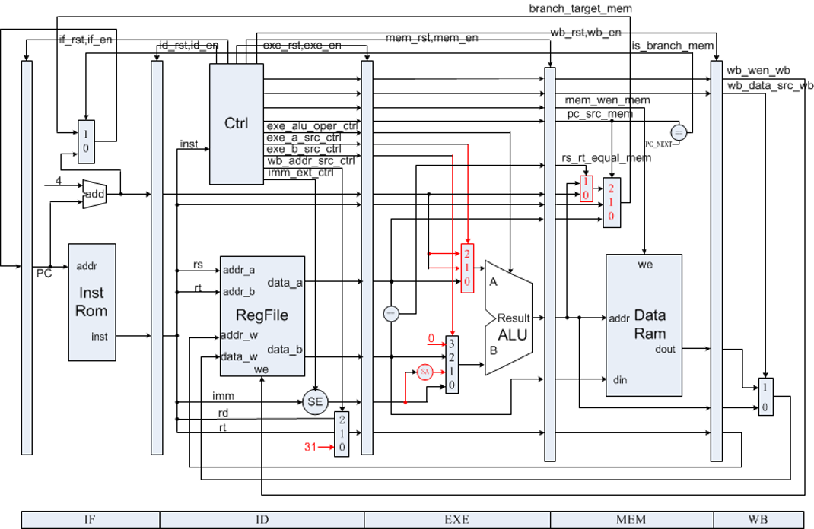

<center>
    <font face="Impact" size="4"><h1>Computer Architecture</h1></font>
    <h1>Lab 3 Report</h1>
</center>
<table align="center">
    <tr>
        <th align="center">Name:</th>
        <td>Asudy Wang 王浚哲</td>
        <th align="center">ID:</th>
        <td>3180103011</td>
        <th align="center">Major:</th>
        <td>Computer Science & Technology</td>
    </tr>
    <tr>
        <th align="center">Course:</th>
        <td colspan="2">Computer Architecture</td>
        <th align="center">Place:</th>
        <td colspan="2">Room 301, Cao Guangbiao Building West Wing, Yuquan Campus</td>
    </tr>
    <tr>
        <td align="center"> <b>Due Date:</b> </td>
        <td> 2020-12-21 </td>
        <td align="center"> <b>Groupmate:</b> </td>
        <td> Flaze He </td>
        <td align="center"> <b>Instructor:</b> </td>
        <td> Kai Bu </td>
    </tr>
</table>


# Table of Contents

[TOC]

# Lab 2. 5-Stage Pipelined CPU with Stall

## §1 Purposes & Requirements

### 1.1 Experiment Purpose

- Understand the **principles** of Pipelined CPU *Stall*;
- Understand the **principles** of *Data Hazard*;
- Understand the method of Pipelined CPU Stall Detection & Stall the Pipeline;
- Master methods of program verification of Pipelined CPU *with Stall*.

### 1.2 Experiment Tasks

- Design the *Stall Part* of Datapath of the 5-stage pipelined CPU implemented in Lab 2.
- Modify the CPU controller by adding *Stall Condition Detection*.
- Verify the *Pipelined CPU* with program and observe the execution of the program.


## §2 Contents & Principles

### 2.1 Datapath

The *datapath* in the *Stall Version* of the 5-staged pipelined CPU is much like the same as the one we've implemented in the previous lab course, since the main difference for detecting & controlling the stalls lies in the *controller*.

A simplified version of the pipelined datapath we implemented in Lab 2 is as the following.


### 2.2 Controller

The controller in the pipelined CPU translates the input **instruction** into several **control signals** asynchronously. Different control signals select inputs for datapath units, control write enable for registers and memories, and *decide whether a certain stage in the datapath is enabled/cleared*. A **datapath with controller** in the pipelined CPU is shown as the following figure:



When an instruction needs to be *stalled*, it is "stopped" at the current stage and "waiting" for the required data. This important operation is done by controller's disabling/clearing a certain stage.

### 2.3 Data Hazard

Data Hazards arise when an instruction depends on the results of a previous instruction in a way that is exposed by the overlapping of instructions in the pipeline.

When $inst_i$ executes before $inst_j$, there're data hazards:

- ***RAW*** (Read After Write), i.e. $inst_j$ reads a source (operand) *before* the $inst_i$ writes it back.
- ***WAW*** (Write After Write), i.e. $inst_j$ writes an operand *before* the $inst_i$ writes it back.
- ***WAR*** (Write After Read), i.e. $inst_j$ writes an operand *before* the $inst_i$ reads it.


## §3 Main Instruments & Materials

### 3.1 Experiment Instruments

1. A Computer with ISE 14.7 Installed
2. SWORD Board

### 3.2 Experiment Materials

None.


## §4 Experiment Procedure & Operations

Thanks to the SWORD Website who provided us with very helpful [Verilog implementations](http://www.sword.org.cn/courses/CompArch) of all units we need except for the *controller* and the *datapath*, all we need to do in this lab is to fill in the blanks in the *controller & datapath* modules, and test if our code makes the CPU run expectedly.

### 4.1 Add Stall Detections & Controls to `controller.v`

1. Open file `controller.v` (in the files downloaded just now) in a text editor. We can find that some codes are masked by `???`.

2. Fill in the blanks in the **pipeline control part** according to the functions of each given instruction. All *parameter* definitions can be found in file `mips_define.vh`. Always use symbols provided in that file if possible.

   The stall control is divided into 2 parts: *register stall* and *branch stall*, of which the meanings and implementations will be shown below.

   1. **Register Stall**

      Register Stalls happen when an instruction is requiring to read an operand at the **ID Stage** which is not yet written back by the precedent instruction. When this happens, we need to *disable IF and ID stage* and *reset the EXE stage*.

      ```verilog
      // Register Stall Detection
      always @(*) begin
      	reg_stall = 0;
      	if (rs_used && addr_rs != 0) begin
      		if (regw_addr_exe == addr_rs && wb_wen_exe) begin
      			reg_stall = 1;
      		end
      		else if (regw_addr_mem == addr_rs && wb_wen_mem) begin
      			reg_stall = 1;
      		end
      	end
      	if (rt_used && addr_rt != 0) begin
      		if (regw_addr_exe == addr_rt && wb_wen_exe) begin
      			reg_stall = 1;
      		end
      		else if (regw_addr_mem == addr_rt && wb_wen_mem) begin
      			reg_stall = 1;
      		end
      	end
      end
      ```

   2. **Branch Stall**

      In our 5-stage pipeline datapath, the *branch destination* can be obtained only at the end of the EXE stage, and we decided to flush the pipeline once there's a branch instruction. So once we detect a branch instruction at the ID stage, 3 NOPs should be inserted, i.e. the ID stage should be reset for 3  clock cycles.

      ```verilog
      always @(*) begin
      	branch_stall = 0;
      	if (pc_src != PC_NEXT || is_branch_exe || is_branch_mem)
      		branch_stall = 1;
      end
      ```

   3. **Pipeline Stall Control**

      This part controls each stage according to the `reg_stall` and `branch_stall` signals as well as the `DEBUG` indicator.

      ```verilog
      always @(*) begin
      	if_rst = 0;
      	if_en = 1;
      	id_rst = 0;
      	id_en = 1;
      	exe_rst = 0;
      	exe_en = 1;
      	mem_rst = 0;
      	mem_en = 1;
      	wb_rst = 0;
      	wb_en = 1;
      	if (rst) begin
      		if_rst = 1;
      		id_rst = 1;
      		exe_rst = 1;
      		mem_rst = 1;
      		wb_rst = 1;
      	end
      	`ifdef DEBUG
      	// suspend and step execution
      	else if ((debug_en) && ~(~debug_step_prev && debug_step)) begin
      		if_en = 0;
      		id_en = 0;
      		exe_en = 0;
      		mem_en = 0;
      		wb_en = 0;
      	end
      	`endif
      	// this stall indicate that ID is waiting for previous instruction, should insert NOPs between ID and EXE.
      	else if (reg_stall) begin
      		if_en = 0;
      		id_en = 0;
      		exe_rst = 1;
      	end
      	// this stall indicate that a jump/branch instruction is running, so that 3 NOP should be inserted between IF and ID
      	else if (branch_stall) begin
      		id_rst = 1;
      	end
      end
      ```

### 4.2 Verify the Pipelined CPU Design

1. Use the program provided by the template (`inst_mem.hex`) to verify the implementation of our *Pipelined CPU*. The code is provided in hexadecimal, which is very difficult for humans to understand. Converting it to something human-readable using a disassembler is a great idea. The translated program (in MIPS) is as the following:

   

2. Open the *ISE Project* and *Generate Programming File* of the top module, then upload the *.bit file* to the SWORD board to see whether our pipelined CPU works as desired.


## §5 Results & Analysis

### 5.1 Function Verification

1. The hexadecimal file used to verify the design and its MIPS assembly comparison is show in the following figure:

   

2. The *Programming File* of the top module was **successfully generated and uploaded** to the SWORD board.

3. Turning on `SW[0]` on board makes the CPU enter *single-step debug* mode, during which time the *bottom-left* `BTN` makes it step forward. All debug information is shown on the *VGA display* connected to the board. 

   You can refer to the *appended zip file* for the photos of the full execution progress of the above program.

4. According to our observation, the program was executed **as desired** on the SWORD board. **We concluded that our *Pipelined CPU* was working as expected.**


## §6 Discussion & Experience

In this lab, I read carefully through the [code provided by SOWRD](http://www.sword.org.cn/courses/CompArch) and understood how *stalls* in a pipelined CPU is detected and implemented. Many auxiliary wires and variables are added to store and pass some states or data of the CPU. The introduction of `en` and `rst` signals played a very important role in controlling the datapath and further, implementing stall controls and debug controls.

<div style="page-break-after: always;"></div>

## Appendix A. *controller.v*

```verilog
`include "define.vh"

/**
 * Controller for MIPS 5-stage pipelined CPU.
 * Author: Zhao, Hongyu  <power_zhy@foxmail.com>
 */
module controller (/*AUTOARG*/
	input wire clk,  // main clock
	input wire rst,  // synchronous reset
	// debug
	`ifdef DEBUG
	input wire debug_en,  // debug enable
	input wire debug_step,  // debug step clock
	`endif
	// instruction decode
	input wire [31:0] inst,  // instruction
	input wire is_branch_exe,  // whether instruction in EXE stage is jump/branch instruction
	input wire [4:0] regw_addr_exe,  // register write address from EXE stage
	input wire wb_wen_exe,  // register write enable signal feedback from EXE stage
	input wire is_branch_mem,  // whether instruction in MEM stage is jump/branch instruction
	input wire [4:0] regw_addr_mem,  // register write address from MEM stage
	input wire wb_wen_mem,  // register write enable signal feedback from MEM stage
	output reg [2:0] pc_src,  // how would PC change to next
	output reg imm_ext,  // whether using sign extended to immediate data
	output reg [1:0] exe_a_src,  // data source of operand A for ALU
	output reg [1:0] exe_b_src,  // data source of operand B for ALU
	output reg [3:0] exe_alu_oper,  // ALU operation type
	output reg mem_ren,  // memory read enable signal
	output reg mem_wen,  // memory write enable signal
	output reg [1:0] wb_addr_src,  // address source to write data back to registers
	output reg wb_data_src,  // data source of data being written back to registers
	output reg wb_wen,  // register write enable signal
	output reg unrecognized,  // whether current instruction can not be recognized
	// pipeline control
	output reg if_rst,  // stage reset signal
	output reg if_en,  // stage enable signal
	input wire if_valid,  // stage valid flag
	output reg id_rst,
	output reg id_en,
	input wire id_valid,
	output reg exe_rst,
	output reg exe_en,
	input wire exe_valid,
	output reg mem_rst,
	output reg mem_en,
	input wire mem_valid,
	output reg wb_rst,
	output reg wb_en,
	input wire wb_valid
	);
	
	`include "mips_define.vh"
	
	// instruction decode
	reg rs_used, rt_used;
	
	always @(*) begin		/* Decode inst */
		pc_src = PC_NEXT;
		imm_ext = 0;
		exe_a_src = EXE_A_RS;
		exe_b_src = EXE_B_RT;
		exe_alu_oper = EXE_ALU_ADD;
		mem_ren = 0;
		mem_wen = 0;
		wb_addr_src = WB_ADDR_RD;
		wb_data_src = WB_DATA_ALU;
		wb_wen = 0;
		rs_used = 0;
		rt_used = 0;
		unrecognized = 0;
		case (inst[31:26])
			INST_R: begin
				case (inst[5:0])
					R_FUNC_JR: begin
						pc_src = PC_JR;
						rs_used = 1;
					end
					R_FUNC_ADD: begin
						exe_alu_oper = EXE_ALU_ADD;
						wb_addr_src = WB_ADDR_RD;
						wb_data_src = WB_DATA_ALU;
						wb_wen = 1;
						rs_used = 1;
						rt_used = 1;
					end
					R_FUNC_SUB: begin
						exe_alu_oper = EXE_ALU_SUB;
						wb_addr_src = WB_ADDR_RD;
						wb_data_src = WB_DATA_ALU;
						wb_wen = 1;
						rs_used = 1;
						rt_used = 1;
					end
					R_FUNC_AND: begin
						exe_alu_oper = EXE_ALU_AND;
						wb_addr_src = WB_ADDR_RD;
						wb_data_src = WB_DATA_ALU;
						wb_wen = 1;
						rs_used = 1;
						rt_used = 1;
					end
					R_FUNC_OR: begin
						exe_alu_oper = EXE_ALU_OR;
						wb_addr_src = WB_ADDR_RD;
						wb_data_src = WB_DATA_ALU;
						wb_wen = 1;
						rs_used = 1;
						rt_used = 1;
					end
					R_FUNC_SLT: begin
						exe_alu_oper = EXE_ALU_SLT;
						wb_addr_src = WB_ADDR_RD;
						wb_data_src = WB_DATA_ALU;
						wb_wen = 1;
						rs_used = 1;
						rt_used = 1;
					end
					default: begin
						unrecognized = 1;
					end
				endcase
			end
			INST_J: begin
				pc_src = PC_JUMP;
			end
			INST_JAL: begin
				pc_src = PC_JUMP;
				exe_a_src = EXE_A_LINK;
				exe_b_src = EXE_B_LINK;
				exe_alu_oper = EXE_ALU_ADD;
				wb_addr_src = WB_ADDR_LINK;
				wb_data_src = WB_DATA_ALU;
				wb_wen = 1;
			end
			INST_BEQ: begin
				pc_src = PC_BEQ;
				exe_a_src = EXE_A_BRANCH;
				exe_b_src = EXE_B_BRANCH;
				exe_alu_oper = EXE_ALU_ADD;
				imm_ext = 1;
				rs_used = 1;
				rt_used = 1;
			end
			INST_BNE: begin
				pc_src = PC_BNE;
				exe_a_src = EXE_A_BRANCH;
				exe_b_src = EXE_B_BRANCH;
				exe_alu_oper = EXE_ALU_ADD;
				imm_ext = 1;
				rs_used = 1;
				rt_used = 1;
			end
			INST_ADDI: begin
				imm_ext = 1;
				exe_b_src = EXE_B_IMM;
				exe_alu_oper = EXE_ALU_ADD;
				wb_addr_src = WB_ADDR_RT;
				wb_data_src = WB_DATA_ALU;
				wb_wen = 1;
				rs_used = 1;
			end
			INST_ANDI: begin
				imm_ext = 0;
				exe_b_src = EXE_B_IMM;
				exe_alu_oper = EXE_ALU_AND;
				wb_addr_src = WB_ADDR_RT;
				wb_data_src = WB_DATA_ALU;
				wb_wen = 1;
				rs_used = 1;
			end
			INST_ORI: begin
				imm_ext = 0;
				exe_b_src = EXE_B_IMM;
				exe_alu_oper = EXE_ALU_OR;
				wb_addr_src = WB_ADDR_RT;
				wb_data_src = WB_DATA_ALU;
				wb_wen = 1;
				rs_used = 1;
			end
			INST_LW: begin
				imm_ext = 1;
				exe_b_src = EXE_B_IMM;
				exe_alu_oper = EXE_ALU_ADD;
				mem_ren = 1;
				wb_addr_src = WB_ADDR_RT;
				wb_data_src = WB_DATA_MEM;
				wb_wen = 1;
				rs_used = 1;
			end
			INST_SW: begin
				imm_ext = 1;
				exe_b_src = EXE_B_IMM;
				exe_alu_oper = EXE_ALU_ADD;
				mem_wen = 1;
				rs_used = 1;
				rt_used = 1;
			end
			default: begin
				unrecognized = 1;
			end
		endcase
	end
	
	/* pipeline control (stall) */
	reg reg_stall;
	reg branch_stall;
	wire [4:0] addr_rs, addr_rt;
	
	assign
		addr_rs = inst[25:21],
		addr_rt = inst[20:16];
	
	always @(*) begin
		reg_stall = 0;
		if (rs_used && addr_rs != 0) begin
			if (regw_addr_exe == addr_rs && wb_wen_exe) begin
				reg_stall = 1;
			end
			else if (regw_addr_mem == addr_rs && wb_wen_mem) begin
				reg_stall = 1;
			end
		end
		if (rt_used && addr_rt != 0) begin
			if (regw_addr_exe == addr_rt && wb_wen_exe) begin
				reg_stall = 1;
			end
			else if (regw_addr_mem == addr_rt && wb_wen_mem) begin
				reg_stall = 1;
			end
		end
	end
	
	always @(*) begin
		branch_stall = 0;
		if (pc_src != PC_NEXT || is_branch_exe || is_branch_mem)
			branch_stall = 1;
	end
	
	`ifdef DEBUG
	reg debug_step_prev;
	
	always @(posedge clk) begin
		debug_step_prev <= debug_step;
	end
	`endif
	
	always @(*) begin
		if_rst = 0;
		if_en = 1;
		id_rst = 0;
		id_en = 1;
		exe_rst = 0;
		exe_en = 1;
		mem_rst = 0;
		mem_en = 1;
		wb_rst = 0;
		wb_en = 1;
		if (rst) begin
			if_rst = 1;
			id_rst = 1;
			exe_rst = 1;
			mem_rst = 1;
			wb_rst = 1;
		end
		`ifdef DEBUG
		// suspend and step execution
		else if ((debug_en) && ~(~debug_step_prev && debug_step)) begin
			if_en = 0;
			id_en = 0;
			exe_en = 0;
			mem_en = 0;
			wb_en = 0;
		end
		`endif
		// this stall indicate that ID is waiting for previous instruction, should insert NOPs between ID and EXE.
		else if (reg_stall) begin
			if_en = 0;
			id_en = 0;
			exe_rst = 1;
		end
		// this stall indicate that a jump/branch instruction is running, so that 3 NOP should be inserted between IF and ID
		else if (branch_stall) begin
			id_rst = 1;
		end
	end
	
endmodule
```

