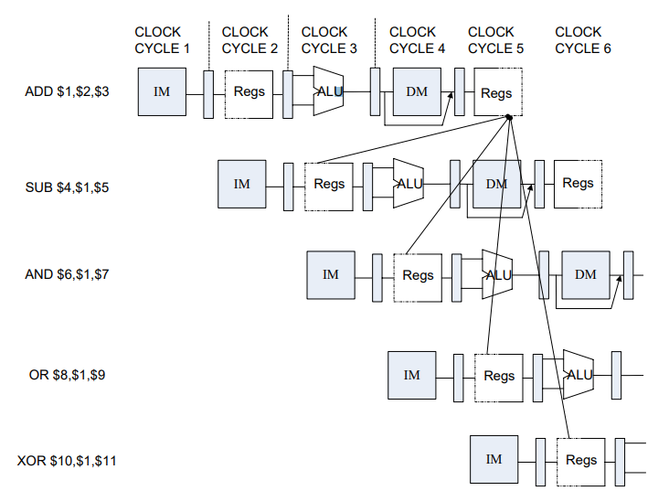
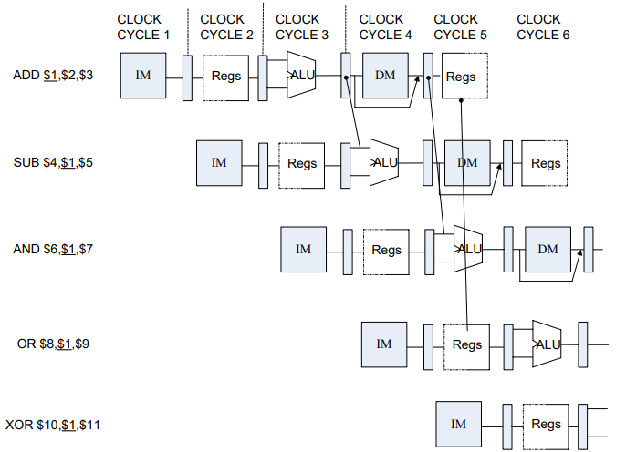
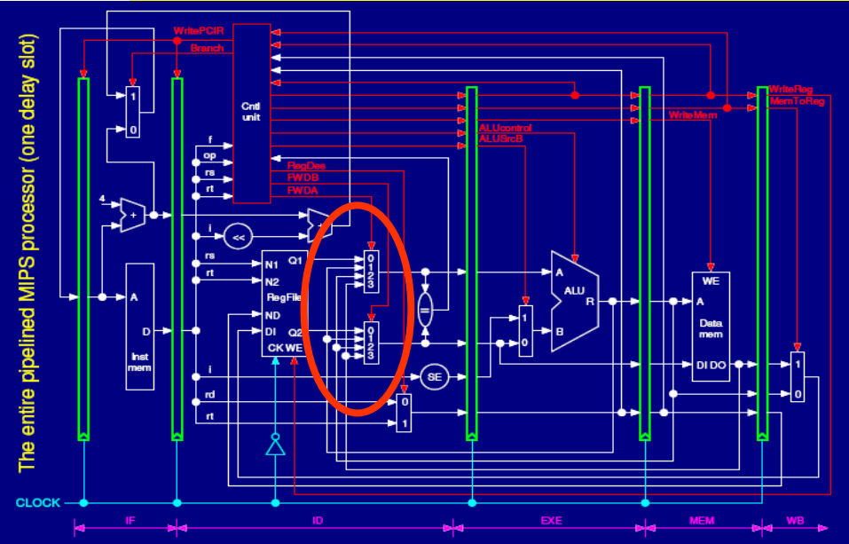
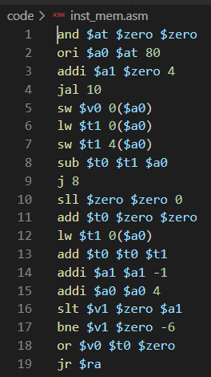
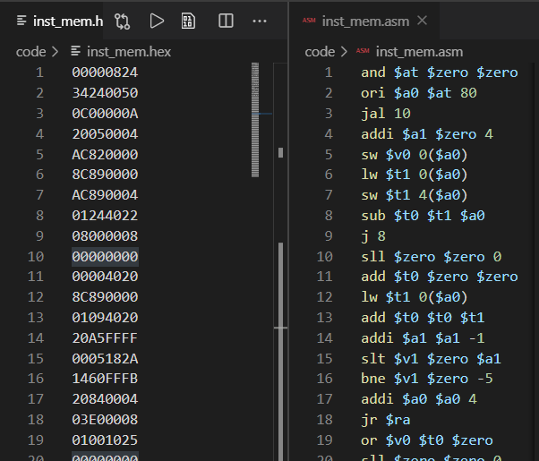

<center>
    <font face="Impact" size="4"><h1>Computer Architecture</h1></font>
    <h1>Lab 4 Report</h1>
</center>
<table align="center">
    <tr>
        <th align="center">Name:</th>
        <td>Asudy Wang 王浚哲</td>
        <th align="center">Student ID:</th>
        <td>3180103011</td>
        <th align="center">Major:</th>
        <td>Computer Science & Technology</td>
    </tr>
    <tr>
        <th align="center">Course:</th>
        <td colspan="2">Computer Architecture</td>
        <th align="center">Place:</th>
        <td colspan="2">Room 301, Cao Guangbiao Building West Wing, <br>Yuquan Campus</td>
    </tr>
    <tr>
        <td align="center"> <b>Due Date:</b> </td>
        <td> 2020-12-28 </td>
        <td align="center"> <b>Groupmate:</b> </td>
        <td> Flaze He </td>
        <td align="center"> <b>Instructor:</b> </td>
        <td> Kai Bu </td>
    </tr>
</table>


# Table of Contents

[TOC]

# Lab 4. Pipelined CPU with Forwarding

## §1 Purposes & Requirements

### 1.1 Experiment Purpose

- Understand the principles of **Pipelined CPU Bypass Unit**.
- Master the method of Pipelined Pipeline **Forwarding Detection** and Pipeline **Forwards**.
- Master the Condition In which Pipeline Forwards.
- Master the Condition In which Bypass Unit doesn’t Work and the Pipeline **stalls**.
- Master methods of program verification of Pipelined CPU with forwarding.

### 1.2 Experiment Tasks

- Design the **Bypass Unit** in datapath of the 5-staged Pipelined CPU.
- **Modify the CPU Controller**
  - Conditions in which the pipeline *forwards.*
  - Conditions in which the pipeline *Stalls.*
- **Verify** the Pipelined CPU with program and observe the execution of the program.


## §2 Contents & Principles

### 2.1 Data Hazard Stalls

- Data hazards happen mostly because that one instruction is reading a register which is NOT written back by the previous instruction yet. For example, in the following figure, the value of register `$1` is required by all instructions except the first one.

  

  In this case, our pipeline will have to **stall** until the result of the first instruction is written back to register `$1` (if we don't have a design for forwarding).

- We can minimize *Data Hazard Stalls* by using ***Forwarding***: transfer the needed (correct) data to other stages in the datapath even if the current instruction isn't finished. In most cases, the data hazard can be resolved by Forwarding (also called *bypassing*, or *short-circuiting*).

  

  We can find that this time the pipeline isn't stalling.

- However, in some cases, data hazards can NOT be resolved by Forwarding and require pipeline stalls.

- 

### 2.2 Datapath

The schematic of the modified datapath is shown in the following figure:



There're $3$ parts to be added in order to implement pipeline forwarding:

1. $rs$ data read from the register file (forwarded to ID stage).
2. $rt$ data read from the register file (forwarded to ID stage).
3. Memory in/out forwarding.

### 2.3 Controller

To implement forwarding and make the additional components of the new datapath work as expected, some control signals need to be added to select the sources.

The relationship between control signals and MUXs is shown in the above figure as well.


## §3 Main Instruments & Materials

### 3.1 Experiment Instruments

1. A Computer with ISE 14.7 Installed
2. SWORD Board

### 3.2 Experiment Materials

None.


## §4 Experiment Procedure & Operations

### 4.1 Modify *datapath.v*

Add the $3$ forwarding wires & MUXs to the datapath.

1. In **ID stage**, add $rs$ and $rt$ source selection:

   ```verilog
   reg [31:0] data_rs_fwd, data_rt_fwd;
   
   always @(*) begin
   	data_rs_fwd = data_rs;
   	data_rt_fwd = data_rt;
   	case (fwd_a_ctrl)
   		0: data_rs_fwd = data_rs;
   		1: data_rs_fwd = alu_out_exe;
   		2: data_rs_fwd = alu_out_mem;
   		3: data_rs_fwd = mem_din;
   	endcase
   	case (fwd_b_ctrl)
   		0: data_rt_fwd = data_rt;
   		1: data_rt_fwd = alu_out_exe;
   		2: data_rt_fwd = alu_out_mem;
   		3: data_rt_fwd = mem_din;
   	endcase
   	rs_rt_equal = (data_rs_fwd == data_rt_fwd);
   end
   ```

2. In **MEM stage**, add memory source selection:

   ```verilog
   // MEM stage
   always @(posedge clk) begin
   	if (mem_rst) begin
   		mem_valid <= 0;
   		inst_addr_mem <= 0;
   		inst_data_mem <= 0;
   		regw_addr_mem <= 0;
   		data_rt_mem <= 0;
   		alu_out_mem <= 0;
   		mem_ren_mem <= 0;
   		mem_wen_mem <= 0;
   		wb_data_src_mem <= 0;
   		wb_wen_mem <= 0;
   		fwd_m_mem <= 0;
   		is_load_mem <= 0;
   	end
   	else if (mem_en) begin
   		mem_valid <= exe_valid;
   		inst_addr_mem <= inst_addr_exe;
   		inst_data_mem <= inst_data_exe;
   		regw_addr_mem <= regw_addr_exe;
   		data_rt_mem <= data_rt_exe;
   		alu_out_mem <= alu_out_exe;
   		mem_ren_mem <= mem_ren_exe;
   		mem_wen_mem <= mem_wen_exe;
   		wb_data_src_mem <= wb_data_src_exe;
   		wb_wen_mem <= wb_wen_exe;
   		fwd_m_mem <= fwd_m_exe;
   		is_load_mem <= is_load_exe;
   	end
   end
   	
   assign
   	mem_ren = mem_ren_mem,
   	mem_wen = mem_wen_mem,
   	mem_addr = alu_out_mem,
   	mem_dout = fwd_m_mem ? regw_data_wb : data_rt_mem;	// Memory source selection
   ```

### 4.2 Modify *controller.v*

Add **Forwarding Control** to the pipeline control of the controller.

```verilog
always @(*) begin
	reg_stall = 0;
	fwd_a = 0;
	fwd_b = 0;
	fwd_m = 0;
    if (rs_used && addr_rs != 0) begin	// check if rs needs to be forwarded
		if (regw_addr_exe == addr_rs && wb_wen_exe) begin
			if (is_load_exe)
				reg_stall = 1;
			else
				fwd_a = 1;
		end
		else if (regw_addr_mem == addr_rs && wb_wen_mem) begin
			if (is_load_mem)
				fwd_a = 3;
			else
				fwd_a = 2;
		end
	end
    if (rt_used && addr_rt != 0) begin	// check if rt needs to be forwarded
		if (regw_addr_exe == addr_rt && wb_wen_exe) begin
			if (is_load_exe) begin
				if (is_store)
					fwd_m = 1;
				else
					reg_stall = 1;
			end
			else
				fwd_b = 1;
		end
		else if (regw_addr_mem == addr_rt && wb_wen_mem) begin
			if (is_load_mem)
				fwd_b = 3;
			else
				fwd_b = 2;
		end
	end
end
```

### 4.3 Verify the Forwarding Design

1. Use the program provided by the template (`inst_mem.hex`) to verify the implementation of our *Pipelined CPU*. The code is provided in hexadecimal, which is very difficult for humans to understand. Converting it to something human-readable using a disassembler is a great idea. The translated program (in MIPS) is as the following:

   

2. Open the *ISE Project* and *Generate Programming File* of the top module, then upload the *.bit file* to the SWORD board to see whether our pipelined CPU works as desired.


## §5 Results & Analysis

### 5.1 Function Verification

1. The hexadecimal file used to verify the design and its MIPS assembly comparison is show in the following figure:

   

2. The *Programming File* of the top module was **successfully generated and uploaded** to the SWORD board.

3. Turning on `SW[0]` on board makes the CPU enter *single-step debug* mode, during which time the *bottom-left* `BTN` makes it step forward. All debug information is shown on the *VGA display* connected to the board. 

   You can refer to the *appended video clip* for the full execution progress of the above program.

   - When executing instruction $2$ (`ori $a0 $at 80`) **without the forwarding components**, the pipeline would *stall* since it reads `$at`, which is the destination register of the previous instruction.
   - **After we added the forwarding support** to the pipeline, however, the pipeline *didn't stall* while executing instruction `ori $a0 $at 80`. That means that our forwarding design worked.

4. According to our observation, the program was executed **as desired** on the SWORD board. **We concluded that our *Pipelined CPU* was working as expected.**


## §6 Discussion & Experience

In this lab course, I reviewed the principles of *pipeline forwarding* and took it into practice. I successfully implemented the Pipeline Forwarding Detection & Control components under the help of online tutorials and the help of my friends. 

<div style="page-break-after: always;"></div>

## Appendix A. *controller.v*

```verilog
`include "define.vh"

module controller (/*AUTOARG*/
	input wire clk,  // main clock
	input wire rst,  // synchronous reset
	// debug
	`ifdef DEBUG
	input wire debug_en,  // debug enable
	input wire debug_step,  // debug step clock
	`endif
	// instruction decode
	input wire [31:0] inst,  // instruction
	input wire rs_rt_equal,  // whether data from RS and RT are equal
	input wire is_load_exe,  // whether instruction in EXE stage is load instruction
	input wire [4:0] regw_addr_exe,  // register write address from EXE stage
	input wire wb_wen_exe,  // register write enable signal feedback from EXE stage
	input wire is_load_mem,  // whether instruction in MEM stage is load instruction
	input wire [4:0] regw_addr_mem,  // register write address from MEM stage
	input wire wb_wen_mem,  // register write enable signal feedback from MEM stage
	output reg [1:0] pc_src,  // how would PC change to next
	output reg imm_ext,  // whether using sign extended to immediate data
	output reg [1:0] exe_a_src,  // data source of operand A for ALU
	output reg [1:0] exe_b_src,  // data source of operand B for ALU
	output reg [3:0] exe_alu_oper,  // ALU operation type
	output reg mem_ren,  // memory read enable signal
	output reg mem_wen,  // memory write enable signal
	output reg [1:0] wb_addr_src,  // address source to write data back to registers
	output reg wb_data_src,  // data source of data being written back to registers
	output reg wb_wen,  // register write enable signal
	output reg [1:0] fwd_a,  // forwarding selection for channel A
	output reg [1:0] fwd_b,  // forwarding selection for channel B
	output reg fwd_m,  // forwarding selection for memory
	output reg is_load,  // whether current instruction is load instruction
	output reg unrecognized,  // whether current instruction can not be recognized
	// pipeline control
	output reg if_rst,  // stage reset signal
	output reg if_en,  // stage enable signal
	input wire if_valid,  // stage valid flag
	output reg id_rst,
	output reg id_en,
	input wire id_valid,
	output reg exe_rst,
	output reg exe_en,
	input wire exe_valid,
	output reg mem_rst,
	output reg mem_en,
	input wire mem_valid,
	output reg wb_rst,
	output reg wb_en,
	input wire wb_valid
	);
	
	`include "mips_define.vh"
	
	// instruction decode
	reg rs_used, rt_used;
	reg is_store;
	
	always @(*) begin
		pc_src = PC_NEXT;
		imm_ext = 0;
		exe_a_src = EXE_A_RS;
		exe_b_src = EXE_B_RT;
		exe_alu_oper = EXE_ALU_ADD;
		mem_ren = 0;
		mem_wen = 0;
		wb_addr_src = WB_ADDR_RD;
		wb_data_src = WB_DATA_ALU;
		wb_wen = 0;
		rs_used = 0;
		rt_used = 0;
		is_load = 0;
		is_store = 0;
		unrecognized = 0;
		case (inst[31:26])
			INST_R: begin
				case (inst[5:0])
					R_FUNC_JR: begin
						pc_src = PC_JR;
						rs_used = 1;
					end
					R_FUNC_ADD: begin
						exe_alu_oper = EXE_ALU_ADD;
						wb_addr_src = WB_ADDR_RD;
						wb_data_src = WB_DATA_ALU;
						wb_wen = 1;
						rs_used = 1;
						rt_used = 1;
					end
					R_FUNC_SUB: begin
						exe_alu_oper = EXE_ALU_SUB;
						wb_addr_src = WB_ADDR_RD;
						wb_data_src = WB_DATA_ALU;
						wb_wen = 1;
						rs_used = 1;
						rt_used = 1;
					end
					R_FUNC_AND: begin
						exe_alu_oper = EXE_ALU_AND;
						wb_addr_src = WB_ADDR_RD;
						wb_data_src = WB_DATA_ALU;
						wb_wen = 1;
						rs_used = 1;
						rt_used = 1;
					end
					R_FUNC_OR: begin
						exe_alu_oper = EXE_ALU_OR;
						wb_addr_src = WB_ADDR_RD;
						wb_data_src = WB_DATA_ALU;
						wb_wen = 1;
						rs_used = 1;
						rt_used = 1;
					end
					R_FUNC_SLT: begin
						exe_alu_oper = EXE_ALU_SLT;
						wb_addr_src = WB_ADDR_RD;
						wb_data_src = WB_DATA_ALU;
						wb_wen = 1;
						rs_used = 1;
						rt_used = 1;
					end
					default: begin
						unrecognized = 1;
					end
				endcase
			end
			INST_J: begin
				pc_src = PC_JUMP;
			end
			INST_JAL: begin
				pc_src = PC_JUMP;
				exe_a_src = EXE_A_LINK;
				exe_b_src = EXE_B_LINK;
				exe_alu_oper = EXE_ALU_ADD;
				wb_addr_src = WB_ADDR_LINK;
				wb_data_src = WB_DATA_ALU;
				wb_wen = 1;
			end
			INST_BEQ: begin
				if (rs_rt_equal) begin
					pc_src = PC_BRANCH;
				end
				imm_ext = 1;
				rs_used = 1;
				rt_used = 1;
			end
			INST_BNE: begin
				if (~rs_rt_equal) begin
					pc_src = PC_BRANCH;
				end
				imm_ext = 1;
				rs_used = 1;
				rt_used = 1;
			end
			INST_ADDI: begin
				imm_ext = 1;
				exe_b_src = EXE_B_IMM;
				exe_alu_oper = EXE_ALU_ADD;
				wb_addr_src = WB_ADDR_RT;
				wb_data_src = WB_DATA_ALU;
				wb_wen = 1;
				rs_used = 1;
			end
			INST_ANDI: begin
				imm_ext = 0;
				exe_b_src = EXE_B_IMM;
				exe_alu_oper = EXE_ALU_AND;
				wb_addr_src = WB_ADDR_RT;
				wb_data_src = WB_DATA_ALU;
				wb_wen = 1;
				rs_used = 1;
			end
			INST_ORI: begin
				imm_ext = 0;
				exe_b_src = EXE_B_IMM;
				exe_alu_oper = EXE_ALU_OR;
				wb_addr_src = WB_ADDR_RT;
				wb_data_src = WB_DATA_ALU;
				wb_wen = 1;
				rs_used = 1;
			end
			INST_LW: begin
				imm_ext = 1;
				exe_b_src = EXE_B_IMM;
				exe_alu_oper = EXE_ALU_ADD;
				mem_ren = 1;
				wb_addr_src = WB_ADDR_RT;
				wb_data_src = WB_DATA_MEM;
				wb_wen = 1;
				is_load = 1;
				rs_used = 1;
			end
			INST_SW: begin
				imm_ext = 1;
				exe_b_src = EXE_B_IMM;
				exe_alu_oper = EXE_ALU_ADD;
				mem_wen = 1;
				is_store = 1;
				rs_used = 1;
				rt_used = 1;
			end
			default: begin
				unrecognized = 1;
			end
		endcase
	end
	
	// pipeline control
	reg reg_stall = 0;
	wire [4:0] addr_rs, addr_rt;
	
	assign
		addr_rs = inst[25:21],
		addr_rt = inst[20:16];
	
	always @(*) begin
		reg_stall = 0;
		fwd_a = 0;
		fwd_b = 0;
		fwd_m = 0;
		if (rs_used && addr_rs != 0) begin
			if (regw_addr_exe == addr_rs && wb_wen_exe) begin
				if (is_load_exe)
					reg_stall = 1;
				else
					fwd_a = 1;
			end
			else if (regw_addr_mem == addr_rs && wb_wen_mem) begin
				if (is_load_mem)
					fwd_a = 3;
				else
					fwd_a = 2;
			end
		end
		if (rt_used && addr_rt != 0) begin
			if (regw_addr_exe == addr_rt && wb_wen_exe) begin
				if (is_load_exe) begin
					if (is_store)
						fwd_m = 1;
					else
						reg_stall = 1;
				end
				else
					fwd_b = 1;
			end
			else if (regw_addr_mem == addr_rt && wb_wen_mem) begin
				if (is_load_mem)
					fwd_b = 3;
				else
					fwd_b = 2;
			end
		end
	end
	
	`ifdef DEBUG
	reg debug_step_prev;
	
	always @(posedge clk) begin
		debug_step_prev <= debug_step;
	end
	`endif
	
	always @(*) begin
		if_rst = 0;
		if_en = 1;
		id_rst = 0;
		id_en = 1;
		exe_rst = 0;
		exe_en = 1;
		mem_rst = 0;
		mem_en = 1;
		wb_rst = 0;
		wb_en = 1;
		if (rst) begin
			if_rst = 1;
			id_rst = 1;
			exe_rst = 1;
			mem_rst = 1;
			wb_rst = 1;
		end
		`ifdef DEBUG
		// suspend and step execution
		else if ((debug_en) && ~(~debug_step_prev && debug_step)) begin
			if_en = 0;
			id_en = 0;
			exe_en = 0;
			mem_en = 0;
			wb_en = 0;
		end
		`endif
		// this stall indicate that ID is waiting for previous LW instruction, should insert one NOP between ID and EXE.
		else if (reg_stall) begin
			if_en = 0;
			id_en = 0;
			exe_rst = 1;
		end
	end
	
endmodule
```

<div style="page-break-after: always;"></div>

## Appendix B. *datapath.v*

```verilog
`include "define.vh"

module datapath (
	input wire clk,  // main clock
	// debug
	`ifdef DEBUG
	input wire [5:0] debug_addr,  // debug address
	output wire [31:0] debug_data,  // debug data
	`endif
	// control signals
	output reg [31:0] inst_data_id,  // instruction
	output reg rs_rt_equal,  // whether data from RS and RT are equal
	output reg is_load_exe,  // whether instruction in EXE stage is load instruction
	output reg [4:0] regw_addr_exe,  // register write address from EXE stage
	output reg wb_wen_exe,  // register write enable signal feedback from EXE stage
	output reg is_load_mem,  // whether instruction in MEM stage is load instruction
	output reg [4:0] regw_addr_mem,  // register write address from MEM stage
	output reg wb_wen_mem,  // register write enable signal feedback from MEM stage
	input wire [1:0] pc_src_ctrl,  // how would PC change to next
	input wire imm_ext_ctrl,  // whether using sign extended to immediate data
	input wire [1:0] exe_a_src_ctrl,  // data source of operand A for ALU
	input wire [1:0] exe_b_src_ctrl,  // data source of operand B for ALU
	input wire [3:0] exe_alu_oper_ctrl,  // ALU operation type
	input wire mem_ren_ctrl,  // memory read enable signal
	input wire mem_wen_ctrl,  // memory write enable signal
	input wire [1:0] wb_addr_src_ctrl,  // address source to write data back to registers
	input wire wb_data_src_ctrl,  // data source of data being written back to registers
	input wire wb_wen_ctrl,  // register write enable signal
	input wire [1:0] fwd_a_ctrl,  // forwarding selection for channel A
	input wire [1:0] fwd_b_ctrl,  // forwarding selection for channel B
	input wire fwd_m_ctrl,  // forwarding selection for memory
	input wire is_load_ctrl,  // whether current instruction is load instruction
	// IF signals
	input wire if_rst,  // stage reset signal
	input wire if_en,  // stage enable signal
	output reg if_valid,  // working flag
	output reg inst_ren,  // instruction read enable signal
	output reg [31:0] inst_addr,  // address of instruction needed
	input wire [31:0] inst_data,  // instruction fetched
	// ID signals
	input wire id_rst,
	input wire id_en,
	output reg id_valid,
	// EXE signals
	input wire exe_rst,
	input wire exe_en,
	output reg exe_valid,
	// MEM signals
	input wire mem_rst,
	input wire mem_en,
	output reg mem_valid,
	output wire mem_ren,  // memory read enable signal
	output wire mem_wen,  // memory write enable signal
	output wire [31:0] mem_addr,  // address of memory
	output wire [31:0] mem_dout,  // data writing to memory
	input wire [31:0] mem_din,  // data read from memory
	// WB signals
	input wire wb_rst,
	input wire wb_en,
	output reg wb_valid
	);
	
	`include "mips_define.vh"
	
	// control signals
	reg [1:0] exe_a_src_exe, exe_b_src_exe;
	reg [3:0] exe_alu_oper_exe;
	reg mem_ren_exe, mem_ren_mem;
	reg mem_wen_exe, mem_wen_mem;
	reg wb_data_src_exe, wb_data_src_mem, wb_data_src_wb;
	reg fwd_m_exe, fwd_m_mem;
	
	// IF signals
	wire [31:0] inst_addr_next;
	
	// ID signals
	reg [31:0] inst_addr_id;
	reg [31:0] inst_addr_next_id;
	reg [4:0] regw_addr_id;
	wire [4:0] addr_rs, addr_rt, addr_rd;
	reg [31:0] data_rs_fwd, data_rt_fwd;
	wire [31:0] data_rs, data_rt, data_imm;
	
	// EXE signals
	reg [31:0] inst_addr_exe;
	reg [31:0] inst_addr_next_exe;
	reg [31:0] inst_data_exe;
	reg [31:0] data_rs_exe, data_rt_exe, data_imm_exe;
	reg [31:0] opa_exe, opb_exe;
	wire [31:0] alu_out_exe;
	
	// MEM signals
	reg [31:0] inst_addr_mem;
	reg [31:0] inst_data_mem;
	reg [31:0] data_rt_mem;
	reg [31:0] alu_out_mem;
	
	// WB signals
	reg wb_wen_wb;
	reg [31:0] alu_out_wb;
	reg [31:0] mem_din_wb;
	reg [4:0] regw_addr_wb;
	reg [31:0] regw_data_wb;
	
	// debug
	`ifdef DEBUG
	wire [31:0] debug_data_reg;
	reg [31:0] debug_data_signal;
	
	always @(posedge clk) begin
		case (debug_addr[4:0])
			0: debug_data_signal <= inst_addr;
			1: debug_data_signal <= inst_data;
			2: debug_data_signal <= inst_addr_id;
			3: debug_data_signal <= inst_data_id;
			4: debug_data_signal <= inst_addr_exe;
			5: debug_data_signal <= inst_data_exe;
			6: debug_data_signal <= inst_addr_mem;
			7: debug_data_signal <= inst_data_mem;
			8: debug_data_signal <= {27'b0, addr_rs};
			9: debug_data_signal <= data_rs;
			10: debug_data_signal <= {27'b0, addr_rt};
			11: debug_data_signal <= data_rt;
			12: debug_data_signal <= data_imm;
			13: debug_data_signal <= opa_exe;
			14: debug_data_signal <= opb_exe;
			15: debug_data_signal <= alu_out_exe;
			16: debug_data_signal <= 0;
			17: debug_data_signal <= {16'b0, 2'b0, fwd_a_ctrl, 2'b0, fwd_b_ctrl, 7'b0, fwd_m_ctrl};
			18: debug_data_signal <= {19'b0, inst_ren, 7'b0, mem_ren, 3'b0, mem_wen};
			19: debug_data_signal <= mem_addr;
			20: debug_data_signal <= mem_din;
			21: debug_data_signal <= mem_dout;
			22: debug_data_signal <= {27'b0, regw_addr_wb};
			23: debug_data_signal <= regw_data_wb;
			default: debug_data_signal <= 32'hFFFF_FFFF;
		endcase
	end
	
	assign
		debug_data = debug_addr[5] ? debug_data_signal : debug_data_reg;
	`endif
	
	// IF stage
	assign
		inst_addr_next = inst_addr + 4;
	
	always @(*) begin
		if_valid = ~if_rst & if_en;
		inst_ren = ~if_rst;
	end
	
	always @(posedge clk) begin
		if (if_rst) begin
			inst_addr <= 0;
		end
		else if (if_en) begin
			case (pc_src_ctrl)
				PC_NEXT: inst_addr <= inst_addr_next;
				PC_JUMP: inst_addr <= {inst_addr_id[31:28], inst_data_id[25:0], 2'b0};
				PC_JR: inst_addr <= data_rs_fwd;
				PC_BRANCH: inst_addr <= inst_addr_next_id + {data_imm[29:0], 2'b0};
			endcase
		end
	end
	
	// ID stage
	always @(posedge clk) begin
		if (id_rst) begin
			id_valid <= 0;
			inst_addr_id <= 0;
			inst_data_id <= 0;
			inst_addr_next_id <= 0;
		end
		else if (id_en) begin
			id_valid <= if_valid;
			inst_addr_id <= inst_addr;
			inst_data_id <= inst_data;
			inst_addr_next_id <= inst_addr_next;
		end
	end
	
	assign
		addr_rs = inst_data_id[25:21],
		addr_rt = inst_data_id[20:16],
		addr_rd = inst_data_id[15:11],
		data_imm = imm_ext_ctrl ? {{16{inst_data_id[15]}}, inst_data_id[15:0]} : {16'b0, inst_data_id[15:0]};
	
	always @(*) begin
		regw_addr_id = inst_data_id[15:11];
		case (wb_addr_src_ctrl)
			WB_ADDR_RD: regw_addr_id = addr_rd;
			WB_ADDR_RT: regw_addr_id = addr_rt;
			WB_ADDR_LINK: regw_addr_id = GPR_RA;
		endcase
	end
	
	regfile REGFILE (
		.clk(clk),
		`ifdef DEBUG
		.debug_addr(debug_addr[4:0]),
		.debug_data(debug_data_reg),
		`endif
		.addr_a(addr_rs),
		.data_a(data_rs),
		.addr_b(addr_rt),
		.data_b(data_rt),
		.en_w(wb_wen_wb),
		.addr_w(regw_addr_wb),
		.data_w(regw_data_wb)
		);
	
	always @(*) begin
		data_rs_fwd = data_rs;
		data_rt_fwd = data_rt;
		case (fwd_a_ctrl)
			0: data_rs_fwd = data_rs;
			1: data_rs_fwd = alu_out_exe;
			2: data_rs_fwd = alu_out_mem;
			3: data_rs_fwd = mem_din;
		endcase
		case (fwd_b_ctrl)
			0: data_rt_fwd = data_rt;
			1: data_rt_fwd = alu_out_exe;
			2: data_rt_fwd = alu_out_mem;
			3: data_rt_fwd = mem_din;
		endcase
		rs_rt_equal = (data_rs_fwd == data_rt_fwd);
	end
	
	// EXE stage
	always @(posedge clk) begin
		if (exe_rst) begin
			exe_valid <= 0;
			inst_addr_exe <= 0;
			inst_data_exe <= 0;
			inst_addr_next_exe <= 0;
			regw_addr_exe <= 0;
			exe_a_src_exe <= 0;
			exe_b_src_exe <= 0;
			data_rs_exe <= 0;
			data_rt_exe <= 0;
			data_imm_exe <= 0;
			exe_alu_oper_exe <= 0;
			mem_ren_exe <= 0;
			mem_wen_exe <= 0;
			wb_data_src_exe <= 0;
			wb_wen_exe <= 0;
			fwd_m_exe <= 0;
			is_load_exe <= 0;
		end
		else if (exe_en) begin
			exe_valid <= id_valid;
			inst_addr_exe <= inst_addr_id;
			inst_data_exe <= inst_data_id;
			inst_addr_next_exe <= inst_addr_next_id;
			regw_addr_exe <= regw_addr_id;
			exe_a_src_exe <= exe_a_src_ctrl;
			exe_b_src_exe <= exe_b_src_ctrl;
			data_rs_exe <= data_rs_fwd;
			data_rt_exe <= data_rt_fwd;
			data_imm_exe <= data_imm;
			exe_alu_oper_exe <= exe_alu_oper_ctrl;
			mem_ren_exe <= mem_ren_ctrl;
			mem_wen_exe <= mem_wen_ctrl;
			wb_data_src_exe <= wb_data_src_ctrl;
			wb_wen_exe <= wb_wen_ctrl;
			fwd_m_exe <= fwd_m_ctrl;
			is_load_exe <= is_load_ctrl;
		end
	end
	
	always @(*) begin
		opa_exe = data_rs_exe;
		opb_exe = data_rt_exe;
		case (exe_a_src_exe)
			EXE_A_RS: opa_exe = data_rs_exe;
			EXE_A_LINK: opa_exe = inst_addr_next_exe;
		endcase
		case (exe_b_src_exe)
			EXE_B_RT: opb_exe = data_rt_exe;
			EXE_B_IMM: opb_exe = data_imm_exe;
			EXE_B_LINK: opb_exe = 32'h4;  // linked address is the next one of the delay slot
		endcase
	end
	
	alu ALU (
		.a(opa_exe),
		.b(opb_exe),
		.oper(exe_alu_oper_exe),
		.result(alu_out_exe)
		);
	
	// MEM stage
	always @(posedge clk) begin
		if (mem_rst) begin
			mem_valid <= 0;
			inst_addr_mem <= 0;
			inst_data_mem <= 0;
			regw_addr_mem <= 0;
			data_rt_mem <= 0;
			alu_out_mem <= 0;
			mem_ren_mem <= 0;
			mem_wen_mem <= 0;
			wb_data_src_mem <= 0;
			wb_wen_mem <= 0;
			fwd_m_mem <= 0;
			is_load_mem <= 0;
		end
		else if (mem_en) begin
			mem_valid <= exe_valid;
			inst_addr_mem <= inst_addr_exe;
			inst_data_mem <= inst_data_exe;
			regw_addr_mem <= regw_addr_exe;
			data_rt_mem <= data_rt_exe;
			alu_out_mem <= alu_out_exe;
			mem_ren_mem <= mem_ren_exe;
			mem_wen_mem <= mem_wen_exe;
			wb_data_src_mem <= wb_data_src_exe;
			wb_wen_mem <= wb_wen_exe;
			fwd_m_mem <= fwd_m_exe;
			is_load_mem <= is_load_exe;
		end
	end
	
	assign
		mem_ren = mem_ren_mem,
		mem_wen = mem_wen_mem,
		mem_addr = alu_out_mem,
		mem_dout = fwd_m_mem ? regw_data_wb : data_rt_mem;
	
	// WB stage
	always @(posedge clk) begin
		if (wb_rst) begin
			wb_valid <= 0;
			wb_wen_wb <= 0;
			wb_data_src_wb <= 0;
			regw_addr_wb <= 0;
			alu_out_wb <= 0;
			mem_din_wb <= 0;
		end
		else if (wb_en) begin
			wb_valid <= mem_valid;
			wb_wen_wb <= wb_wen_mem;
			wb_data_src_wb <= wb_data_src_mem;
			regw_addr_wb <= regw_addr_mem;
			alu_out_wb <= alu_out_mem;
			mem_din_wb <= mem_din;
		end
	end
	
	always @(*) begin
		regw_data_wb = alu_out_wb;
		case (wb_data_src_wb)
			WB_DATA_ALU: regw_data_wb = alu_out_wb;
			WB_DATA_MEM: regw_data_wb = mem_din_wb;
		endcase
	end
	
endmodule
```

