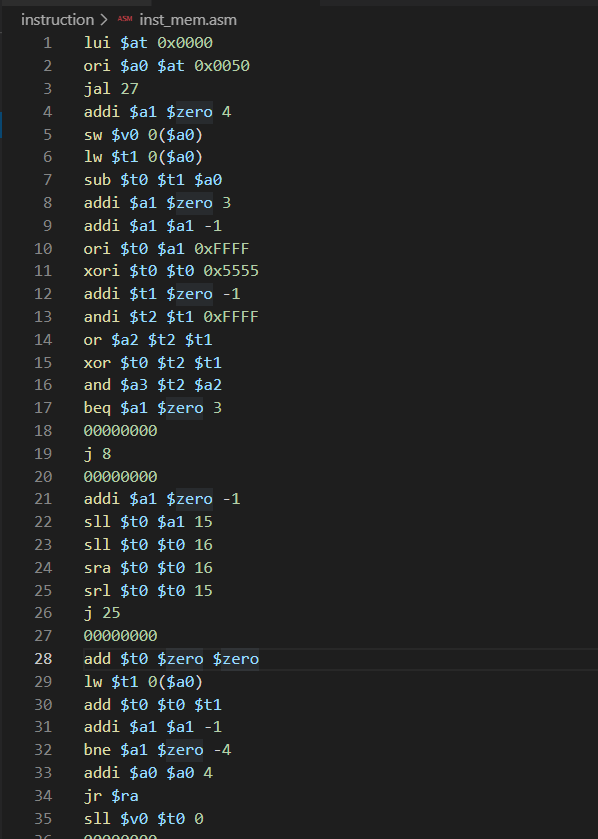

<center>
    <font face="Impact" size="4"><h1>Computer Architecture</h1></font>
    <h1>Lab 5 Report</h1>
</center>
<table align="center">
    <tr>
        <th align="center">Name:</th>
        <td>Asudy Wang 王浚哲</td>
        <th align="center">ID:</th>
        <td>3180103011</td>
        <th align="center">Major:</th>
        <td>Computer Science & Technology</td>
    </tr>
    <tr>
        <th align="center">Course:</th>
        <td colspan="2">Computer Architecture</td>
        <th align="center">Place:</th>
        <td colspan="2">Room 301, Cao Guangbiao Building West Wing, Yuquan Campus</td>
    </tr>
    <tr>
        <td align="center"> <b>Due Date:</b> </td>
        <td> 2021-01-21 </td>
        <td align="center"> <b>Groupmate:</b> </td>
        <td> Flaze He </td>
        <td align="center"> <b>Instructor:</b> </td>
        <td> Kai Bu </td>
    </tr>
</table>


# Table of Contents

[TOC]

# Lab 5. Pipelined CPU resolving control hazard and supporting 31 MIPS instructions

## §1 Purposes & Requirements

### 1.1 Experiment Purpose

- Understand 31 MIPS instructions.
- Understand **why and when Control Hazards arise**. 
- Master the methods of resolving Control Hazards.
  - Freeze or flush
  - Predict-not-taken
  - Predict-taken
  - Delayed-branch

### 1.2 Experiment Tasks

- Extend your design to support all the 31 MIPS instructions in pipelined CPU.
- Implement the **predict-not-taken** scheme in your final pipelined CPU.
- Write the **verification program** yourself to test whether it can execute right in *both taken and not-taken* cases and to *test all the 31 instructions*. 


## §2 Contents & Principles

### 2.1 31 MIPS instructions to be Supported

The following chart shows the 31 instructions our CPU will support after the modification. The ==highlighted lines== are instructions to be added to our existing design.


What we're supposed to do in this lab is to **decode** the 32 bit binary instructions and **control** the corresponding components to implement the target function.


## §3 Main Instruments & Materials

### 3.1 Experiment Instruments

1. A Computer with ISE 14.7 Installed
2. SWORD Board

### 3.2 Experiment Materials

None.


## §4 Experiment Procedure & Operations

### 4.1 Modify *controller.v*

To implement the extended instructions, firstly we need to **decode** the instruction binary and activate the corresponding *control signals* in the *controller* module. Add new instruction decoding code to the controller.

> *Note: The following code is only partial (added part) of the module.*

```verilog
case (inst[31:26])
	INST_R: begin
        // ...
        case ( inst[5:0] )
            R_FUNC_SLLV: begin
                exe_alu_oper = EXE_ALU_SL;
                wb_addr_src = WB_ADDR_RD;
                wb_data_src = WB_DATA_ALU;
                wb_wen = 1;
                rs_used = 1;
                rt_used = 1;
            end
            R_FUNC_SRLV: begin
                exe_alu_oper = EXE_ALU_SR;
                wb_addr_src = WB_ADDR_RD;
                wb_data_src = WB_DATA_ALU;
                wb_wen = 1;
                rs_used = 1;
                rt_used = 1;
            end
            R_FUNC_SRAV: begin
                exe_alu_oper = EXE_ALU_SR;
                exe_signed = 1;
                wb_addr_src = WB_ADDR_RD;
                wb_data_src = WB_DATA_ALU;
                wb_wen = 1;
                rs_used = 1;
                rt_used = 1;
            end
            R_FUNC_JR: begin
                pc_src = PC_JR;
                rs_used = 1;
            end
			R_FUNC_ADDU: begin
                exe_alu_oper = EXE_ALU_ADD;
                wb_addr_src = WB_ADDR_RD;
                wb_data_src = WB_DATA_ALU;
                wb_wen = 1;
                rs_used = 1;
                rt_used = 1;
            end
            R_FUNC_SUBU: begin
                exe_alu_oper = EXE_ALU_SUB;
                wb_addr_src = WB_ADDR_RD;
                wb_data_src = WB_DATA_ALU;
                wb_wen = 1;
                rs_used = 1;
                rt_used = 1;
            end
            R_FUNC_SLT: begin
                exe_alu_oper = EXE_ALU_SLT;
                exe_signed = 1;
                wb_addr_src = WB_ADDR_RD;
                wb_data_src = WB_DATA_ALU;
                wb_wen = 1;
                rs_used = 1;
                rt_used = 1;
            end
            R_FUNC_SLTU: begin
                exe_alu_oper = EXE_ALU_SLT;
                wb_addr_src = WB_ADDR_RD;
                wb_data_src = WB_DATA_ALU;
                wb_wen = 1;
                rs_used = 1;
                rt_used = 1;
            end
            // ...
        endcase
    end
    // ...
    INST_ADDIU: begin
        imm_ext = 1;
        exe_b_src = EXE_B_IMM;
        exe_alu_oper = EXE_ALU_ADD;
        wb_addr_src = WB_ADDR_RT;
        wb_data_src = WB_DATA_ALU;
        wb_wen = 1;
        rs_used = 1;
    end
    INST_SLTI: begin
        imm_ext = 1;
        exe_b_src = EXE_B_IMM;
        exe_alu_oper = EXE_ALU_SLT;
        exe_signed = 1;
        wb_addr_src = WB_ADDR_RT;
        wb_data_src = WB_DATA_ALU;
        wb_wen = 1;
        rs_used = 1;
    end
    INST_SLTIU: begin
        imm_ext = 1;
        exe_b_src = EXE_B_IMM;
        exe_alu_oper = EXE_ALU_SLT;
        wb_addr_src = WB_ADDR_RT;
        wb_data_src = WB_DATA_ALU;
        wb_wen = 1;
        rs_used = 1;
    end
    INST_XORI: begin
        imm_ext = 0;
        exe_b_src = EXE_B_IMM;
        exe_alu_oper = EXE_ALU_XOR;
        wb_addr_src = WB_ADDR_RT;
        wb_data_src = WB_DATA_ALU;
        wb_wen = 1;
        rs_used = 1;
    end
    INST_LUI: begin
        exe_b_src = EXE_B_IMM;
        exe_alu_oper = EXE_ALU_LUI;
        wb_addr_src = WB_ADDR_RT;
        wb_data_src = WB_DATA_ALU;
        wb_wen = 1;
    end
    // ...
endcase
```

As you may have already noticed, a lot of new macros are used for our new instructions. Therefore new symbols should be added to file *mips_define.vh* as well. You may find the modified version of that file in the *<u>Appendix</u>* section of this report.

### 4.2 Modify *datapath.v*

Once the new instructions are decoded, **physical components and datapaths** are needed in order to realize the actual functionality. Thus new *wires and MUXs* need to be added to our datapath. The following figure shows a reference of the modification of the datapath.


1. In ***IF*** stage, the number of PC sources is extended to 4 so that `j`, `jal` and branch instructions can be supported.

   ```verilog
   always @(posedge clk) begin
       if (if_rst) begin
           inst_addr <= 0;
       end
       else if (if_en) begin
           case (pc_src_ctrl)
               PC_NEXT: inst_addr <= inst_addr_next;
               PC_JUMP: inst_addr <= {inst_addr_id[31:28], inst_data_id[25:0], 2'b0};
               PC_JR: inst_addr <= data_rs_fwd;
               PC_BRANCH: inst_addr <= inst_addr_next_id + {data_imm[29:0], 2'b0};
           endcase
       end
   end
   ```

2. In ***EXE*** stage, an additional operation is added to support shift instructions

   ```verilog
   always @(*) begin
   	opa_exe = data_rs_exe;
   	opb_exe = data_rt_exe;
   	case (exe_a_src_exe)
   		EXE_A_RS: opa_exe = data_rs_exe;
           EXE_A_SA: opa_exe = {27'b0, data_imm_exe[10:6]};	// Added
   		EXE_A_LINK: opa_exe = inst_addr_next_exe;
   	endcase
   	case (exe_b_src_exe)
   		EXE_B_RT: opb_exe = data_rt_exe;
   		EXE_B_IMM: opb_exe = data_imm_exe;
   		EXE_B_LINK: opb_exe = 32'h4;  
   	endcase
   end
   ```

3. Add a `sign` flag as the ***ALU*** input to specify a signed/unsigned operation of `slt` or `sr` (shift right) instructions.

   ```verilog
   // File: alu.v
   module alu (
   	input wire [31:0] a, b,  // two operands
   	input wire sign,  // signed/unsigned flag		newly added
   	input wire [3:0] oper,  // operation type
   	output reg [31:0] result  // calculation result
   	);
       `include "mips_define.vh"
       always @(*) begin
           // ...
           case (oper)
               // ...
               EXE_ALU_SLT: begin
                   if (sign)
                       result = $signed(a) < $signed(b);
                   else
                       result = $unsigned(a) < $unsigned(b);
               end
               // ...
           	EXE_ALU_SR: begin
                   if (sign)
                       result = $signed(b) >>> a[4:0];
                   else
                       result = $unsigned(b) >> a[4:0];
               end
               // ...
           endcase
       end
   endmodule
   ```

   And add a signal `exe_signed_exe` in the datapath to support those instructions.

### 4.3 Verify the Design

1. Use the program provided (`inst_mem.hex`) to verify the implementation of our *Pipelined CPU*. The code is provided in hexadecimal, which is very difficult for humans to understand. Converting it to something human-readable using a *disassembler* is a great idea. 

   However, since new instructions are added, our old Mr. disassembler doesn't recognize all of the coming instructions now. Some modifications are required to be carried out on our disassembler as well. The following screenshot shows our new friends to the disassembler:

   

   

   Eventually, the translated program (in MIPS) is as the following:

   

2. Open the *ISE Project* and *Generate Programming File* of the top module, then upload the *.bit file* to the SWORD board to see whether our pipelined CPU works as desired.


## §5 Results & Analysis

### 5.1 Function Verification

1. The hexadecimal file used to verify the design and its MIPS assembly comparison is show in the following figure:

   

2. The *Programming File* of the top module was **successfully generated and uploaded** to the SWORD board.

3. Turning on `SW[0]` on board makes the CPU enter *single-step debug* mode, during which time the *bottom-left* `BTN` makes it step forward. All debug information is shown on the *VGA display* connected to the board. 

   You can ***refer to the appended video clip*** for the full execution progress of the above program.

   - **All mentioned instructions are successfully executed.**
   - The control hazard is implemented as *predict-not-taken*.

4. According to our observation, the program was executed **as desired** on the SWORD board. **We concluded that our *Pipelined CPU* was working as expected.**


## §6 Discussion & Experience

During this lab, I studied on the added instructions about how they're actually executed by the datapath, and thought carefully what MUXs and signals I should add to the existing controller. At the meantime, I reviewed the concept of control hazards, carrying out the predict-not-taken method to our pipelined CPU. Eventually 31 required instructions are all supported by our CPU while the resolving of control hazards reduced the unnecessary stalls during its execution.

This is the last lab assignment of *Computer Architecture*. At the beginning of this semester, I'm totally blank about a *pipelined CPU*. However, it's really amazing that at the end of the semester, I have a "DIY" pipelined CPU which supports stall, forwarding and 31 MIPS instructions with control hazards also resolved. This is really *WOW*.

<div style="page-break-after: always;"></div>

## Appendix. *mips_define.vh*

```verilog
// PC sources
localparam
	PC_NEXT    = 0,
	PC_JUMP    = 1,
	PC_JR      = 2,
//	PC_BEQ     = 4,
//	PC_BNE     = 5;
	PC_BRANCH  = 3;

// EXE A sources
localparam
	EXE_A_RS     = 0,
	EXE_A_SA     = 1,
	EXE_A_LINK   = 2;
//	EXE_A_BRANCH = 3;

// EXE B sources
localparam
	EXE_B_RT     = 0,
	EXE_B_IMM    = 1,
	EXE_B_LINK   = 2,
	EXE_B_BRANCH = 3;

// EXE ALU operations
localparam
	EXE_ALU_ADD    = 0,
	EXE_ALU_SUB    = 1,
	EXE_ALU_SLT    = 2,
	EXE_ALU_LUI    = 3,
	EXE_ALU_AND    = 4,
	EXE_ALU_OR     = 5,
	EXE_ALU_XOR    = 6,
	EXE_ALU_NOR    = 7,
	EXE_ALU_SL     = 8,
	EXE_ALU_SR     = 9;

// WB address sources
localparam
	WB_ADDR_RD    = 0,
	WB_ADDR_RT    = 1,
	WB_ADDR_LINK  = 2;

// WB data sources
localparam
	WB_DATA_ALU   = 0,
	WB_DATA_MEM   = 1;

// variables
localparam
	PC_RESET  = 32'h0000_0000;

// instructions
localparam  // bit 31:26 for instruction type
	INST_R          = 6'b000000,  // bit 5:0 for function type
	R_FUNC_SLL      = 6'b000000,
	R_FUNC_SRL      = 6'b000010,  // including ROTR(set bit 21)
	R_FUNC_SRA      = 6'b000011,
	R_FUNC_SLLV     = 6'b000100,
	R_FUNC_SRLV     = 6'b000110,  // including ROTRV(set bit 6)
	R_FUNC_SRAV     = 6'b000111,
	R_FUNC_JR       = 6'b001000,
	//R_FUNC_JALR     = 6'b001001,
	//R_FUNC_MOVZ     = 6'b001010,
	//R_FUNC_MOVN     = 6'b001011,
	//R_FUNC_SYSCALL  = 6'b001100,
	R_FUNC_ADD      = 6'b100000,
	R_FUNC_ADDU     = 6'b100001,
	R_FUNC_SUB      = 6'b100010,
	R_FUNC_SUBU     = 6'b100011,
	R_FUNC_AND      = 6'b100100,
	R_FUNC_OR       = 6'b100101,
	R_FUNC_XOR      = 6'b100110,
	R_FUNC_NOR      = 6'b100111,
	R_FUNC_SLT      = 6'b101010,
	R_FUNC_SLTU     = 6'b101011,
	//R_FUNC_TGE      = 6'b110000,
	//R_FUNC_TGEU     = 6'b110001,
	//R_FUNC_TLT      = 6'b110010,
	//R_FUNC_TLTU     = 6'b110011,
	//R_FUNC_TEQ      = 6'b110100,
	//R_FUNC_TNE      = 6'b110110,
	//INST_I          = 6'b000001,  // bit 20:16 for function type
	//I_FUNC_BLTZ     = 5'b00000,
	//I_FUNC_BGEZ     = 5'b00001,
	//I_FUNC_TGEI     = 5'b01000,
	//I_FUNC_TGEIU    = 5'b01001,
	//I_FUNC_TLTI     = 5'b01010,
	//I_FUNC_TLTIU    = 5'b01011,
	//I_FUNC_TEQI     = 5'b01100,
	//I_FUNC_TNEI     = 5'b01110,
	//I_FUNC_BLTZAL   = 5'b10000,
	//I_FUNC_BGEZAL   = 5'b10001,
	INST_J          = 6'b000010,
	INST_JAL        = 6'b000011,
	INST_BEQ        = 6'b000100,
	INST_BNE        = 6'b000101,
	//INST_BLEZ       = 6'b000110,
	//INST_BGTZ       = 6'b000111,
	INST_ADDI       = 6'b001000,
	INST_ADDIU      = 6'b001001,
	INST_SLTI       = 6'b001010,
	INST_SLTIU      = 6'b001011,
	INST_ANDI       = 6'b001100,
	INST_ORI        = 6'b001101,
	INST_XORI       = 6'b001110,
	INST_LUI        = 6'b001111,
	//INST_CP0        = 6'b010000,  // bit 24:21 for function type when bit 25 is not set, bit 5:0 for co type when bit 25 is set
	//CP_FUNC_MF     = 4'b0000,
	//CP_FUNC_MT     = 4'b0100,
	//CP0_CO_ERET     = 6'b011000,
	//INST_LB         = 6'b100000,
	//INST_LH         = 6'b100001,
	INST_LW         = 6'b100011,
	//INST_LBU        = 6'b100100,
	//INST_LHU        = 6'b100101,
	//INST_SB         = 6'b101000,
	//INST_SH         = 6'b101001,
	INST_SW         = 6'b101011;

// general registers
localparam
	GPR_ZERO = 0,
	GPR_AT = 1,
	GPR_V0 = 2,
	GPR_V1 = 3,
	GPR_A0 = 4,
	GPR_A1 = 5,
	GPR_A2 = 6,
	GPR_A3 = 7,
	GPR_T0 = 8,
	GPR_T1 = 9,
	GPR_T2 = 10,
	GPR_T3 = 11,
	GPR_T4 = 12,
	GPR_T5 = 13,
	GPR_T6 = 14,
	GPR_T7 = 15,
	GPR_S0 = 16,
	GPR_S1 = 17,
	GPR_S2 = 18,
	GPR_S3 = 19,
	GPR_S4 = 20,
	GPR_S5 = 21,
	GPR_S6 = 22,
	GPR_S7 = 23,
	GPR_T8 = 24,
	GPR_T9 = 25,
	GPR_K0 = 26,
	GPR_K1 = 27,
	GPR_GP = 28,
	GPR_SP = 29,
	GPR_FP = 30,
	GPR_RA = 31;
```

